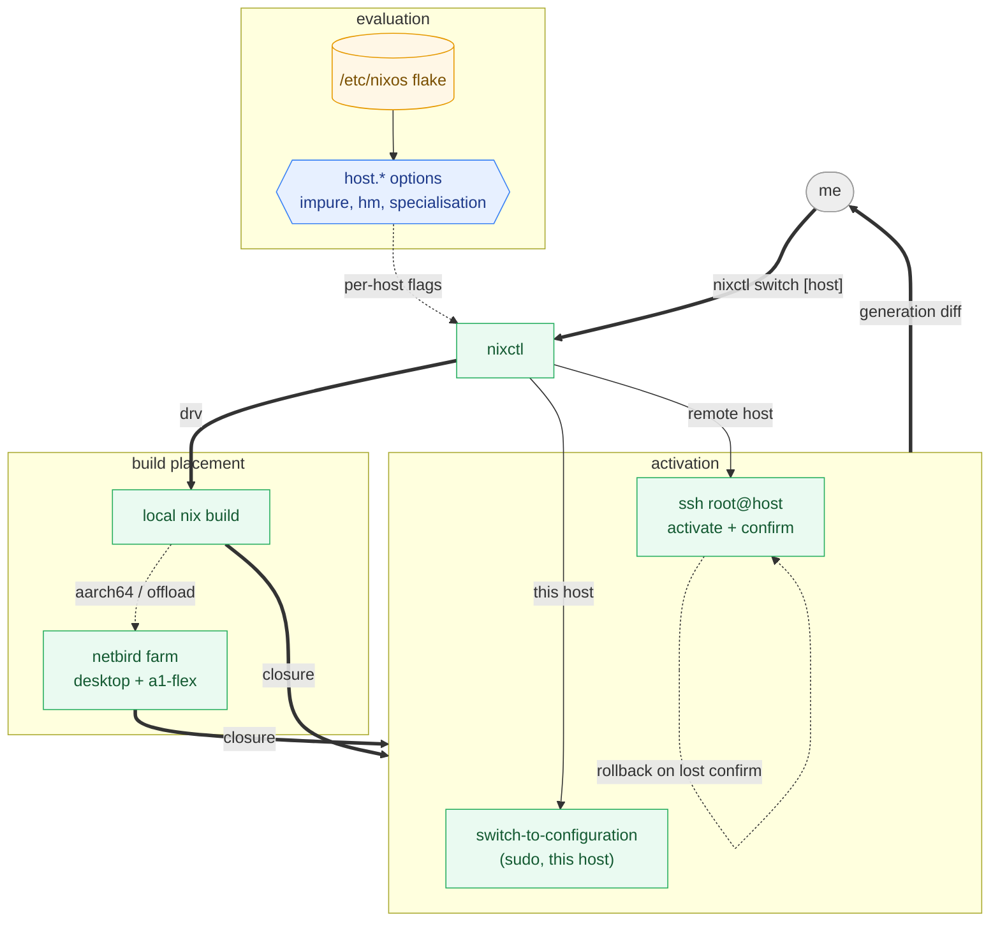

# nixctl

One command for every machine in the fleet, local or remote, with per-host build
policy read out of the flake instead of frozen into a shell function.

Replaces the five zsh wrappers in `users/ironmoon/bundles/zsh/program.nix:219-256`
and the `deploy-rs` half of the workflow. `nh` was evaluated and rejected; §2 says
why.

Throughout: **[verified]** marks something observed by running it, with the
command. Repo facts are cited by path. Everything else is design intent, and §10
lists what is actually built.

## 1. Shape

The fleet is 9 active machines in two classes that today need two different tools.

| Class | Hosts | Arch | HM | Reached by |
|---|---|---|---|---|
| interactive | fw13, fw12, desktop | x86_64 | NixOS module | local `nixos-rebuild` |
| server | hetzner-cx33-1, ovh-vps1-1, oracle-e2-1-micro-{1,2} | x86_64 | none (`no-hm`) | `deploy-rs`, root SSH |
| server | oracle-a1-flex-{1,2} | aarch64 | none (`no-hm`) | `deploy-rs`, root SSH |

Server addresses come from `inputs.secrets.data.ips.<id>`, falling back ipv4 →
ipv6 → bare id (`flake.nix`, `deploy.nodes`). `oracle-e2-1-micro-{3,4}` and
`oracle-a1-flex-3` are defined but commented out.



## 2. Why not nh, why not deploy-rs

Three concrete gaps, chosen over the alternative of wrapping nh.

**Impure / out-of-store symlinks.** nh has no `--impure`. §4 shows this is a
subtler problem than "pass the flag".

**Remote is a different tool.** `deploy.nodes` is `mapAttrs … servers` only — the
three interactive machines are not deploy targets, and the six servers are not
`nixos-rebuild` targets. Two tools, two flag vocabularies, two failure modes, and
no single command that answers "is the fleet current?".

**Output.** The wrappers already pipe `--log-format=internal-json` into `nom`, so
that part works. What is missing is everything after the build: no closure diff,
no "what will change", no dry run that is cheaper than a real build.

Not a motivation, explicitly: the `/etc/secrets` push-then-relock flow. It stays
manual.

nh is otherwise fine and its specialisation convention is worth keeping — it reads
`/etc/specialisation`, which `hosts/common/specializations/default.nix` now writes
for every specialisation. **[verified]** `nh os switch --help` offers
`-s/--specialisation` and `-S/--no-specialisation`; nh 4.4.2 is not installed here.

## 3. Command surface

```
nixctl switch  [host…]      build, diff, confirm, activate, persist
nixctl test    [host…]      … activate without making it the boot default
nixctl boot    [host…]      … persist without activating
nixctl build   [host…]      build only, print the diff
nixctl diff    [host…]      diff built closure against the running generation
nixctl status  [host…]      running vs. buildable generation, per host
nixctl update  [input…]     flake update, then status
```

`host` defaults to the current machine. `all` means every machine in
`nixosConfigurations`. Whether a host is local or remote is derived, never a flag:
if `host.id` matches the running system it is local, otherwise it is remote.

`switch`/`test`/`boot` keep meaning exactly what `nixos-rebuild` means by them, so
the muscle memory from the current wrappers survives.

## 4. Host policy lives in the flake

The wrappers bake `--impure` in at Nix eval time from
`config.host.out-of-store-symlinks`, so the flag is a property of the *machine the
shell was built for*, not of the machine being built. `nixctl` reads
`host.out-of-store-symlinks`, `host.home-manager-nixos` and friends per target and
constructs the command from them.

The impure story is worse than it looks, and this is the part worth designing
around rather than reproducing.

**[verified]** `desktop` sets `out-of-store-symlinks = true`, yet evaluates
*purely*, to a drv byte-identical to the impure one:

```
nix eval --raw '/etc/nixos#nixosConfigurations.desktop.…toplevel.drvPath'
  -> /nix/store/88vg8h7h4a61kzazd8m84zqnax5zqig4-nixos-system-desktop-….drv
```

Because **[verified]** `builtins.getEnv` is not an error in pure mode, it is empty:

```
nix eval --raw --expr 'builtins.getEnv "ROOT_NIXOS_PATH"'            ->
nix eval --raw --impure --expr 'builtins.getEnv "ROOT_NIXOS_PATH"'   -> /etc/nixos
```

and `users/my-utils.nix` reads

```nix
rootNixPath = builtins.getEnv "ROOT_NIXOS_PATH";
rootDir = if rootNixPath == "" then "/etc/nixos" else rootNixPath;
```

So `--impure` is not required by out-of-store symlinks at all. It is required only
to let `ROOT_NIXOS_PATH` override a hardcoded `/etc/nixos`, and today those agree
because the devshell sets `ROOT_NIXOS_PATH=$(git rev-parse --show-toplevel)` and
the checkout is `/etc/nixos`.

The failure mode is silent: build a checkout at `~/nixos` in pure mode and every
out-of-store symlink points into `/etc/nixos` — a different tree, or none. No
error, wrong dotfiles.

`nixctl` knows the flake path because it is the thing resolving it. It should pass
the root in explicitly and refuse to proceed when the resolved root and the actual
checkout disagree, turning a silent wrong answer into a refusal. Whether that is
done by keeping `--impure` and setting `ROOT_NIXOS_PATH` itself, or by threading
the path through a module argument and dropping impurity entirely, is open (§11).

## 5. One pipeline, two activation backends

Every subcommand is the same pipeline; only the last step differs.

```
resolve host → eval drv → build (§6) → diff (§7) → confirm → activate → persist
```

- **local** — `sudo …/bin/switch-to-configuration switch|test|boot`. Same as
  today, minus `nixos-rebuild`'s own eval.
- **remote** — copy the closure, then activate over SSH with a confirmation
  timeout: activate, wait for the caller to confirm reachability, roll back to the
  previous generation if the confirmation never arrives. This is what deploy-rs's
  `activate`/`magic-rollback` does, and it is the single feature that makes
  remote-switching a VPS not terrifying.

Reimplementing rollback rather than shelling out to deploy-rs is the one place
this design takes on real risk. §11 has the alternative.

## 6. Build placement

`bundles/distributed-builds.nix:19-51` already defines the farm — desktop
(x86_64, 8 jobs, speed 4) and `oracle-a1-flex-{1,2,3}` (aarch64, 2 jobs, speed
1/3/1) over Netbird, host keys pinned, with `active` filtering out the machine
doing the asking.

`nixctl` does not manage builders; it inherits them. What it adds is choosing
*where evaluation and building happen* for a remote target: build locally and push
the closure, or evaluate and build on the target. For the 1 GB Oracle micros the
answer is always "not on the target"; for `hetzner-cx33-1` either works. This is
per-host policy and belongs next to `host.*`, not in a flag.

## 7. Output, diff, dry-run

Keep `--log-format=internal-json` piped to `nom`; it is already the right answer
and reimplementing a build monitor is not the point.

Add, after the build:

- **closure diff** against the running generation, in the shape `nvd`/`nix store
  diff-closures` produce: added, removed, version-changed, total size delta.
- **`nixctl status`** across the fleet: for each host, running generation vs. what
  the current flake would produce, so "is anything stale?" is one command.
- **dry run** that reports what *would* be built and downloaded without doing it
  (`nix build --dry-run` semantics), distinct from `nixctl build`.

A diff before activation is what makes `switch` on a remote host reviewable rather
than a leap.

## 8. Specialisations

`hosts/common/specializations/` defines `hyprland` and `kde`, and its
`default.nix` extends the `specialisation` option's submodule so every entry
writes its own name to `/etc/specialisation`. **[verified]** on `desktop`:
`hyprland → "hyprland"`, `kde → "kde"`, parent has no such file.

`nixctl` reads that file to stay in the current specialisation across a rebuild,
with `-s <name>` to switch and `-S` to drop to the base config — nh's vocabulary,
because there is no reason to invent another.

## 9. Failure and rollback

- Never leave a remote host unreachable: confirmation timeout with automatic
  rollback (§5).
- `all` is fail-slow, not fail-fast: one broken host must not stop the rest, and
  the summary must say which failed. This mirrors `--keep-going` in the current
  wrappers.
- Refuse to activate a closure built from a dirty tree without an explicit
  override — the drv is not reproducible from anything committed.

## 10. Implementation status

Nothing is built. This document exists before the crate, deliberately.

Prerequisites that already exist:

- `crates/` is a Cargo workspace (`members = ["slurm-ci"]`) with clap + anyhow
  already in the lock, so a second member adds no flake inputs
- `flake.nix` has the `packages.slurm-ci = pkgs.pkgsStatic.callPackage …` pattern
  to copy; `nixctl` runs only on Nix hosts, so it does not need `pkgsStatic`
- `/etc/specialisation` (§8) is written
- the build farm (§6) is configured

## 11. Open decisions

- **Name.** `nixctl` is a placeholder; nothing depends on it, so renaming is a
  `git mv` plus the flake's `packages` entry.
- **Rollback: reimplement or delegate.** §5 assumes `nixctl` owns
  confirm-or-rollback. The alternative is shelling out to `deploy-rs` for remote
  activation and keeping only the UI, which is far less code and keeps a
  battle-tested rollback path, at the cost of the unified model that motivated
  this in the first place.
- **How the flake root reaches the modules.** §4 leaves open whether to keep
  `--impure` + `ROOT_NIXOS_PATH`, or thread the path through `specialArgs` and
  evaluate purely. The second removes an entire class of silent misconfiguration
  but touches `users/my-utils.nix` and every consumer of `symlink`.
- **Where per-host build policy is declared.** §6 wants "build this host's system
  locally, never on the target". That is a new `host.*` option, which means the
  tool's behaviour is configured by the thing it builds — fine, but it is a
  bootstrapping loop worth being deliberate about.
- **Whether `nixctl` subsumes `home-manager-switch`.** `host.home-manager-nixos`
  is true everywhere today, so the standalone path in
  `nix/home-manager-standalone.nix` is currently dead weight; deleting it is
  cheaper than supporting it.
