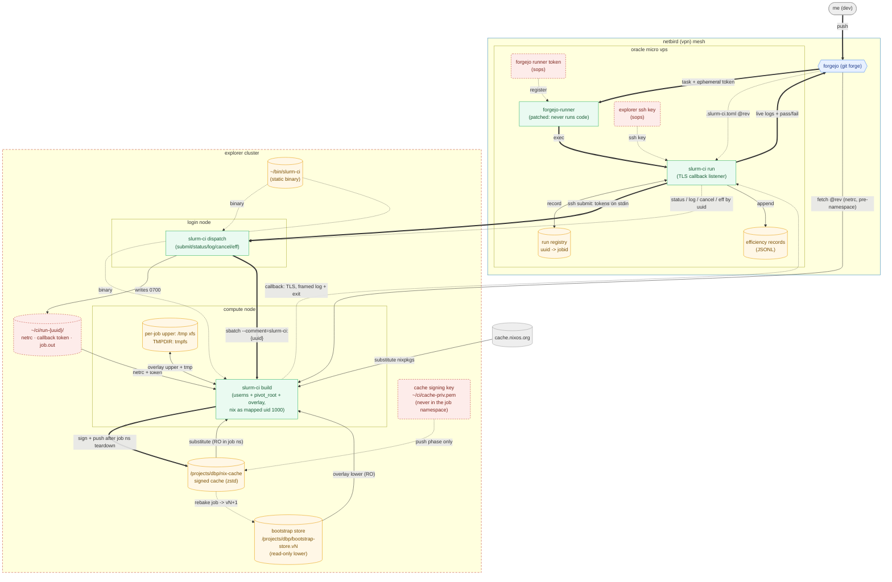

# slurm-ci

Run Forgejo Actions CI on NEU's Explorer/Discovery Slurm cluster: the always-on
x86 build capacity the aarch64 free-tier fleet lacks.

Daniel Patterson (PI, Slurm account `d.patterson`) sponsored the cluster access
in Jan 2026 for exactly this. SSH is key-based and Duo-free, and adding a key is
documented by RC, so both the use and the mechanism are sanctioned. The original
architecture was sent to him 2026-06-10; the store/runtime half was redesigned
and measured 2026-08-21; the trust and control-plane halves were revised later
the same day against seven independent reviews.

**What the capacity is worth.** List price for whole-node x86 is about $5/hr
(on-demand Linux, Aug 2026): AWS `m6a.32xlarge` (128 vCPU / 512 GiB) $5.53/hr,
`c6a.32xlarge` (128 vCPU / 256 GiB) $4.90/hr, GCP `c2d-standard-112` (112 vCPU
/ 448 GB) $5.08/hr — 128-thread parity does not exist in C2D, which stops at
112. The standing alternative is a rented dedicated box (Hetzner AX162-R, EPYC
9454P 48c/96t, €199–244/mo excl. VAT): a recurring bill for capacity that is
idle between pushes. `sharing` is $0 marginal against a fair-share obligation.
The chromium run (§16) is the artifact that argues the project: 56,879 actions
compiled inside the hour is a class of build no aarch64 free tier will ever
run, on hardware nothing in the fleet has.

**The contract.** A repo gets CI by declaring installables in `.slurm-ci.toml`.
A green check means exactly one thing: `nix build` of those installables
succeeded on a cluster node. Workflow steps do not run — the runner is patched
so no `run:`/`uses:` ever executes, and a workflow that is not the bare hand-off
shape is a hard error rather than a silent pass. No secrets reach a build and no
artifacts come back; the cache carries store paths, and everything else is logs
and a pass/fail.

Throughout: **[verified]** marks something observed on the cluster, with the
command or number that showed it. **[open]** marks a claim that one command
would settle — those are collected in §12. Everything else is design intent;
§12 also lists what is actually built.

## 1. Shape

The cluster is a CI *executor*, not a `nix.buildMachines` row. Two properties
rule out the remote-builder model outright: there is no root, so `/nix` cannot
exist natively; and compute nodes are scheduled and ephemeral, so no persistent
`nix-daemon` can run.

`oracle-e2-1-micro-4` is an always-on dispatcher. It runs a patched
`forgejo-runner` and cannot build anything itself.

**Source is fetched by the compute node, credential-sequenced.** Forgejo is
publicly reachable (owner-confirmed; probe row in §12), so `build()` fetches
the pinned rev directly — *before* constructing any namespace: fetch with the
run-dir netrc onto node-local disk, verify, unlink the netrc, and only then
run nix. Repo-controlled code and the credential never coexist, and the
credential never enters a namespace at all. Fetch mechanism is an open
decision (§13): a scrubbed `git clone` (`GIT_CONFIG_GLOBAL=/dev/null`, no
credential helpers; clone/checkout executes no repo-controlled code — hooks
don't transfer and filters need client config) verifies `rev-parse HEAD`
against the pin cryptographically; the forge's rev-addressed archive endpoint
(`curl --netrc-file …/archive/<rev>.tar.gz`) deletes host git from the path
entirely at the cost of trusting the forge's TLS for tree integrity — which is
already the trust root for the code. (A ship-source-as-tree design was adopted
and reverted within the review pass; §13.)

## 2. Roles

One static-musl binary, every role, because the cluster-side roles run on
foreign non-Nix hosts. On the VPS the work is split between a daemon and a
per-task client: N `run` processes cannot each own port 443, and
`SO_REUSEPORT` cannot route by token because the token is inside TLS, so the
listener has to be one long-lived process — and once it exists it is the
natural owner of the registry, the pinned cert, the SSH key and the JSONL.

- **`listen`** — the VPS daemon. Owns 443, the cert, the registry, the SSH
  key and the JSONL; accepts tasks from `run` over a unix socket; drives each
  attempt to a verdict (below, described as `run`'s job — it is the daemon's
  driver thread that does it); reconciles the registry on startup.
- **`run`** — what the patched runner execs per task. Sends the task over the
  socket, relays `INFO`/`DATA` frames to the job log, exits with the verdict.
  SIGTERM becomes a `CANCEL` frame, answered promptly because the runner
  SIGKILLs after `WaitDelay`. Holds no credential but the Forgejo token, and
  that only to hand over for the toml fetch.
- **The driver** (per attempt, in the daemon). Mints a run UUID, resolves the task to a rev, reads
  `.slurm-ci.toml` from the forge's raw-file endpoint **at that rev** — never
  at branch head, since the toml must describe the tree the cluster will
  actually build and the trigger-to-submit gap is a real TOCTOU window; a
  chromium-class repo therefore costs the VPS one HTTP GET and no clone —
  submits one `sbatch`, records `uuid → jobid` before anything else can fail,
  then *listens* for the compute node rather than polling the queue. A SIGTERM
  (Forgejo cancel or timeout) `scancel`s the job. On startup it reconciles the
  registry by **re-attaching**: probe `status`, fetch `log`, conclude from
  sacct (§3's fallback verdict). It never `scancel`s a job because the
  listener died — a VPS restart mid-build must not kill builds; cancellation
  only ever propagates an explicit Forgejo cancel.
  If the `submit` reply is lost after `sbatch` already succeeded, `run` holds a
  uuid and no jobid, and nothing scans, so the verb path cannot find that job.
  It is recovered at job start instead — the callback's `HELLO` carries
  `$SLURM_JOB_ID` (§3) — which leaves only the job that never starts, bounded
  by `--deadline` and collected by the run-dir prune (§4).
- **`dispatch`** — on the login node, as an SSH forced command. Parses the
  untrusted `$SSH_ORIGINAL_COMMAND` as argv, never through a shell, and reads
  secrets from stdin so nothing appears in `ps` on a shared login node. Verbs:
  `submit`, `status`, `log`, `cancel`, `eff`.
- **`build`** — on the compute node. Fetches the pinned rev
  (credential-sequenced, §1), constructs the namespace/overlay environment
  (§5–§6), runs `nix build` against that tree as an unprivileged mapped uid
  inside it, then — after that namespace is gone — signs and pushes outputs.

Job config comes from the repo's `.slurm-ci.toml` (installables, cores, mem,
time, jobs; optional partition/constraint/exclusive/tmpdir per §8). Decided
2026-08-21: keep it repo-side. **Dispatch-side magnitude caps ship in v1**, not as later hardening:
the toml is attacker-controlled the moment any repo has a second committer, and
a typo is enough. Caps are the contract with the person whose `RawShares 1` we
are spending — see §8.

**Version handshake.** One binary, two install locations, updated at different
times. `submit` refuses a `run` whose protocol version it does not speak, so a
half-deployed upgrade fails at submit rather than in a namespace.

## 3. Callback

The first design had `run` hold an `srun` open for the duration. Rejected: Slurm
PENDING time is unbounded, so a busy cluster means an SSH connection held open
for hours across a Netbird overlay from a 1 GB VPS. False-red is the worst CI
signal, and that failure correlates with exactly when CI matters.

So: `sbatch` and disconnect. The compute node opens a connection back to the
VPS; the login node sees one `sbatch`, plus an occasional status probe.

Being cheap on the login node is a hard requirement, not politeness: this is
someone else's shared infrastructure and the access is a favour. (The login
node also runs a process reaper — it killed a `watch` with a 30s interval — so
nothing of ours may run resident there.) Status probes therefore back off
exponentially; each one is an SSH handshake.

**This is a public listener, not a mesh RPC.** Compute nodes are not on
Netbird, so the connection is compute → campus NAT → public internet → the
VPS's public IP. It carries the pass/fail verdict, which makes it the one path
where a semi-hostile context talks to the trust anchor. Specification:

- **Port 443** on the VPS, because the only measured egress fact is TCP 443
  (§10), and Oracle blocks ingress by default — the NSG/security-list rule is
  explicit deployment work.
- **TLS** with a pinned self-signed cert; the fingerprint travels in the run
  directory at submit time.
- **Token**: ≥128-bit CSPRNG, single-use, bound to the run UUID. It lives in a
  0600 file in the run directory — never in argv, never in the `sbatch` script
  text, because `/proc/<pid>/cmdline` is world-readable and a `sharing` node has
  other tenants on it.
- **One listener, N outstanding tokens**: each token's first valid connection
  claims that run and retires the token, so a captured token cannot be
  replayed and a thief cannot pre-empt the real build. Rotating the pinned
  cert invalidates in-flight runs (the fingerprint is captured at submit) —
  rotate when the registry is empty.
- **Framed messages** (`HELLO` / `DATA` / `HEARTBEAT` / `EXIT`),
  length-prefixed. "Log bytes, then the exit code" mis-parses the first build
  that prints a number. Heartbeat interval well under common NAT idle timeouts
  (~300s), and heartbeat loss is an availability signal — probe, don't kill.
  `HELLO` carries the uuid, the token, and `$SLURM_JOB_ID`; the jobid is what
  re-attaches a run whose submit reply was lost, and a forged one is inert,
  because every verb re-checks that job's comment tag before acting (§4).
- **Fail-closed against the spoofable channel only.** A forged `EXIT` is what
  the token + TLS defend against, so a missing/invalid `EXIT` frame never
  yields green *from the callback*. But the fallback chain — `status`, then
  sacct terminal state — arrives over the SSH verb path, the same channel the
  control plane already trusts for red verdicts and `eff`; `State=COMPLETED,
  ExitCode=0:0` there is the same fact as `EXIT(0)`, reported by the same
  wrapper over a harder-to-spoof channel. So: **green via fallback iff the
  allocation row's `State` is `COMPLETED`, or it is `FAILED` and the `.batch`
  step's `ExitCode` is exactly `PUSH_FAILED:0`**; everything else is red, and
  inconclusive-red is reserved for absent or conflicting evidence. (Refusing
  fallback-green would manufacture exactly the false-red §3 exists to kill, and
  would make a job that completed while the VPS was down impossible to ever
  conclude.) This requires the wrapper's exit status to *be* the verdict: it
  propagates nix's exit code, with `PUSH_FAILED` distinguished so an infra
  hiccup after a successful build reads as green-with-warning, not red — and
  the callback path must special-case `EXIT(PUSH_FAILED)` identically, since it
  is the same verdict on the other channel.

  **Both halves of that rule are necessary and neither is sufficient**, which
  is worth stating because two plausible simplifications are both wrong.
  `State` alone cannot express built-ok-but-push-failed: Slurm defines
  `COMPLETED` as "finished with an exit code of zero on all nodes" and `FAILED`
  as "non-zero exit code or other failure condition", so the distinguished code
  reports `FAILED` by construction. `ExitCode` alone is a **false-green
  generator**: **[verified]** job 9442675 reports `State=TIMEOUT`,
  `ExitCode=0:0` on the allocation row while its `.batch` step reports
  `CANCELLED`, `0:15` — a job the scheduler killed at the wall clock carries a
  zero exit code at job level, so any rule keyed on `ExitCode` alone calls a
  timed-out build green. `State` decides whether `ExitCode` means anything;
  `ExitCode` then supplies the verdict; and the two come from different rows,
  which the `eff` verb already has to merge (§9).
- **No session tickets, orderly close.** The build side only ever writes.
  Anything the server sends after the handshake (TLS 1.3 tickets) sits unread
  in the client's receive queue, and `close()` on a socket with unread data
  sends RST, on which the server discards what it has not yet read — the
  `EXIT` frame, under load. **[verified]** in the sandboxed test run
  2026-09-14 (passed locally, lost the frame in the loaded nix sandbox). So
  `send_tls13_tickets = 0`, resumption off, and the client closes with
  close_notify then drains to EOF.
- **Best-effort from the build's side**: a callback that cannot connect, or
  drops, never fails or stalls the build. The Slurm output file in the run
  directory is the authoritative log, and the `log` verb reads it; the callback
  is the live convenience path. `run` streams rather than buffers — a 128-core
  build's log will OOM a 1 GB VPS otherwise.
- **Firewall** the port to Explorer's egress prefix.

## 4. Trust model

**Who can trigger.** Trusted refs only: pushes to repos I control. Fork-PR
triggers are out of scope until the §8 caps and this section's boundaries are
implemented and tested, because a PR author controls both the flake and the
toml.

**What crosses into the cluster.** A rev pin, a short-lived repo-scoped
Forgejo token, and a per-run callback token. Nothing durable. Both tokens are
0600 files in the run directory and **on disk only during PENDING**: at job
start `build()` reads both into memory and unlinks — the netrc after the
fetch, the callback token immediately — all before any namespace exists, and
neither is ever exported into the nix environment. The PENDING-window
exposure on NFS is acceptable *because the account is single-tenant*; that
premise is load-bearing and would need revisiting with a shared account.
Decided 2026-09-14: **v1 sends no Forgejo token to the cluster.** Public repos
clone without one, and deferring it until a private repo exists deletes its
crash windows from v1; the run dir holds only the callback token. The VPS
still uses the runner's token for the toml fetch. (Out of scope either way: a CI target whose flake
has private `git+ssh` *inputs* — that is a different credential problem this
design does not cover.)

**Run-dir lifecycle.** `dispatch` prunes stale run dirs on every `submit`,
with the same `sinfo MaxTime`-derived grace as the bootstrap reaper (§6), so
cancel-before-start, node crash, or VPS death cannot accumulate orphans.
`job.out` is kept until the `eff` record is written, plus the last N runs for
autopsy.

**What a build can reach.** The §5 rootfs and nothing else: its own tmpfs, the
overlay `/nix`, the binary cache read-only, and the fetched source tree. Not
`/home` — the run directory is consumed before the namespace exists and is
never bound into it — not the rest of `/projects`, not the host's `/etc`,
`/var`, `/run`, or `/usr`.

That last line is the correction that motivated this revision. The rootfs was
inherited from the benchmark, where breadth was convenience, and it made §4's
own argument false: `~/ci/cache-priv.pem` was readable by anything running in
the job. Nix's *evaluator* is not sandboxed — only builders are — so
`builtins.readFile` plus a fixed-output derivation (which gets network by
design) is a complete read-and-exfiltrate primitive. Reading the signing key
means minting valid signatures for arbitrary store paths, which makes
`require-sigs` worthless against precisely the adversary it exists for.

Scope of that primitive, checked rather than assumed: it is **read**, not write.
Builders can write but live in nix's sandbox with no view of the host tree;
`__noChroot` is refused under `sandbox = true`; `builtins.exec` needs
`allow-unsafe-native-code-during-evaluation`. The one plausible eval-time write
vector is git's `ext::` transport through an attacker-controlled `fetchGit`
URL — **[verified]** blocked: nix 2.34 rejects it at URL parse (`SCP-like URL
'ext::sh -c …' is not supported`). That is a property of nix's URL parser and
not a designed boundary, so the key is masked regardless. The invariant,
stated precisely: **the key is never readable while repo-controlled code can
run** — not "never in a namespace." The push phase (§5 step 5) runs inside the
outer namespace after the untrusted child has exited, and that is fine,
because at that point the namespace contains only our own code.

**What the VPS is given**: a runner registration token and an SSH key to
Explorer, both from sops. The key is `restrict`ed and pinned to a forced
command. **The verb list is the capability grant**: the surface grows by
enumerated verbs with fixed argv and per-verb validation, never by generality.
No verb passes caller-controlled strings into a shell or query language.
`--account` is pinned in the forced-command line itself
(`command="CI_SLURM_ACCOUNT=d.patterson ..."`), so a VPS-side mistake cannot
route jobs through another account (relevant once a second account via Amal
exists).

**Verbs act only on our own jobs.** `submit` tags every job
`--comment=slurm-ci:<uuid>`; `status`/`log`/`cancel`/`eff` take **jobid +
uuid** (the VPS registry knows both), and dispatch verifies the pair against
the run dir's own `jobid` file, written right after `sbatch` — zero or
mismatching → refuse. (Implemented that way rather than by re-reading the
job's comment, because `scontrol` forgets a finished job after `MinJobAge`
and `sacct` only carries comments with `AccountingStoreFlags=job_comment`;
the run dir is under our uid and outlives both.) The comment stays on the job
for `squeue` visibility and the in-flight count. Nothing scans for it. Without this, a buggy or compromised `run` can
`scancel` any job on the account — including an interactive session or a
rebake, and eventually Amal's work. (The tag authenticates against *mistakes*,
not a same-account adversary — anything with the uid can forge it, and can
equally `scancel` directly; a caveat that matters once a second account
exists.)

Stating the capability honestly: a compromised VPS can run **arbitrary code as
the cluster user, bounded by Slurm's resource limits and the §5 filesystem
isolation**. That is what a Nix build is; fixed-output derivations get network
by design. What it cannot do is escape the verb list, pick another account, or
exceed the caps.

Two more capabilities, off the cluster and therefore not bounded by any of
that. The VPS holds the runner token, so a compromised VPS can mark arbitrary
commits green having built nothing: **the check attests to the VPS, not to the
cluster**, and must never be the sole gate in branch protection. And a build
makes arbitrary outbound connections from a compute node's network position —
`flake.lock` URLs and fixed-output fetches are the intended use, campus-internal
hosts are reachable by the same mechanism. Same class as any hosted CI,
accepted with the TCB, and named here rather than discovered in an incident.

Why the runner is patched rather than configured: stock `forgejo-runner` is
remote code execution as a service, and the VPS sits on the Netbird mesh. The
patch builds the workflow plan (so the workflow is still parsed and validated)
and then never invokes the executor. Two consequences that need enforcing, not
documenting:

- **False-green is the failure mode.** A workflow containing `run: make test`
  would otherwise get a green check with nothing run. The patch hard-fails any
  workflow that is not the bare hand-off shape (one job, our label, no
  meaningful steps).
- **The patch is not a privilege boundary and it is a rebase tax.** Pin the
  runner version, keep the re-patch procedure next to the patch, and carry an
  integration test asserting that a `run:` step demonstrably does not execute,
  so a botched rebase fails loudly instead of silently restoring RCE.

Why the shared store and cache are safe to reuse: builds are sandboxed, and
every path *substituted* into a store is signature-checked. Locally built
outputs are not signature-checked on entry — they are trusted because we built
them, which is the same statement with the quantifier stated correctly.

- `sandbox = true`, `sandbox-fallback = false`
- `require-sigs = true`
- substituters are exactly `cache.nixos.org` and our own signed cache
- `accept-flake-config = false`
- `build-users-group =` (empty; single-user mode)
- installables are constrained to the fetched tree (`path:`/`.#`), checked
  after normalisation — reject `..`, absolute paths, and anything URL-shaped;
  a URL installable would evaluate a remote flake that never went through
  review

The cache's trust model is **single-tenant and author-trusted**: it is safe
across *jobs* because of the above, and safe across *repos* only because all
the repos are mine. Nothing about signing makes it safe across trust levels;
that would need per-trust-level caches. At rest, the cache, the bootstrap store,
and `~/bin/slurm-ci` are protected by NFS file permissions and nothing else.

This rests on an explicit TCB assumption: Nix's sandbox plus kernel namespacing.
Containers already rely on the same, so this is not a new exposure.

## 5. Execution stack

nix-portable is gone (post-mortem in §14). `build()` constructs the environment
itself — the entire stack is stock kernel plus the bootstrap store's own
binaries:

0. Every namespaced role is a re-exec of the static binary (`__ns <role>`),
   so `unshare(CLONE_NEWUSER)` sees a single-threaded process with a cleared
   environment and no inherited fds beyond stdio.
1. `unshare(CLONE_NEWUSER|CLONE_NEWNS)`, self-map to root in the namespace,
   **then `unshare(CLONE_NEWPID)` and re-exec the role as that namespace's
   pid 1** — before any rootfs work. **[verified 2026-09-14, fw13 7.2]** a
   proc mount inside a userns is refused (EPERM) unless it is for a *new* pid
   namespace, and only by a process holding CAP_SYS_ADMIN in the userns that
   *owns* that pid namespace. Both constraints shape everything below.
2. Build a **minimal** rootfs on a fresh tmpfs:
   - `/nix` — the overlay (§6)
   - `/tmp` — private tmpfs, the default `TMPDIR`
   - `/xtmp` — bind of a node-local xfs dir, the big-build `TMPDIR`
   - `/src` — the fetched source tree, bound from node-local xfs (UUID-keyed,
     reaped by the same gate as the upper). *Not* on the tmpfs: a
     chromium-class checkout is tens of GB, and tmpfs would bill it to
     `--mem` before the build starts.
   - `/proc` fresh, `/sys` read-only, `/dev` minimal (`null zero full random
     urandom tty`, `shm` as tmpfs)
   - `/etc` synthesised: `passwd`/`group` stubs for the mapped uid,
     `nsswitch.conf`, `hosts`, and the host's `resolv.conf` — unless that
     points at a loopback stub resolver (`127.0.0.53`), which is dead inside
     the namespace and times out every substitution; then synthesise
     `nameserver` lines from a reachable resolver instead (gate probe)
   - the binary cache path, **read-only**, for substitution
   Everything the job runs comes from the bootstrap store (nix, git, cacert,
   coreutils, bash), so no host `/usr /bin /sbin /lib* /var /run /opt /home`
   bind is needed. `NIX_SSL_CERT_FILE` points at the store's cacert.
   The overlay's *lower* needs no bind in the new root — overlayfs holds it by
   dentry, not by path — so `/projects` appears only as the read-only cache
   **[open]**.
3. `pivot_root` into it and lazy-detach the old root. **Not chroot**:
   **[verified]** `unshare(CLONE_NEWUSER)` fails with EPERM from a chrooted
   process (`current_chrooted()` check), which would break both our nested map
   and Nix's own sandbox clone.
4. `unshare(CLONE_NEWPID)` — which takes effect for the *next* fork, not for
   the caller — then exec `__stub`. Pid 1 of the innermost namespace stays
   ours rather than being nix: an ancestor namespace's default-action signals
   are dropped by an init without a handler, so exec'ing nix there would make
   SIGTERM delivery (§ signal discipline) depend on nix's handler table. The
   stub installs handlers, `unshare(CLONE_NEWUSER|CLONE_NEWNS)` self-mapping
   0 → 1000, and *then* `unshare(CLONE_NEWPID)` + a plain `fork()` — the
   nested pid namespace must be created inside the mapped userns or nobody
   can mount its `/proc`, and the init must be a fork rather than an exec
   because exec as uid 1000 drops the capabilities the mount needs. That
   forked init mounts a fresh `/proc` — a procfs instance shows the pid
   namespace of whoever mounted it, so each level needs its own, with
   propagation private so none clobbers another — spawns nix (the only exec,
   and therefore the only uncapable process), forwards TERM, and exits when
   nix does. After the stub is gone the outer role `setns`es its
   pid-for-children back to its own namespace: **[verified]** a later
   `fork()` into the dead namespace fails with ENOMEM, which is exactly where
   the push phase's `nix path-info` would otherwise die.
5. `wait()` the untrusted child — **the isolation boundary is the child's
   lifetime, not the namespace's**, and the PID namespace is what makes that
   boundary structural rather than inferred: pid_namespaces(7) has the kernel
   SIGKILL every remaining process in a namespace when its init exits, so
   nothing repo-controlled can outlive the `wait()` and watch the push phase.
   Without it, the same claim rests on nix reliably killing its builders as it
   dies — a property of nix's implementation, not of the system, and not one
   this design should be resting a key on. Then, with the overlay still mounted and
   in the same outer namespace, bind the key in and run fixed-argv
   `nix store sign` + `nix copy` (§7); then tear down. Tearing down first
   does not work: an unmounted upper is not a store — whiteouts, split
   copy-ups, a db referencing lower paths that physically aren't there — and
   remounting means re-proving the §6 preamble for nothing. (If a
   teardown-first shape is ever forced, the fallback is a second overlay
   mount over the same upper with a *fresh* workdir — the `volatile` marker
   lives in the workdir.) The push can run as in-ns root: the mapped-root
   failure (§5 above) is builder *spawn*; copy/substitution worked as root in
   the `raw-root` A/B.

**[verified] Never run nix as the namespace's root.** As mapped-root, nix's
sandboxed-builder spawn fails (`unable to start build process`) while
substitutions succeed — confirmed by a paired A/B config (`raw-root`) on
2026-08-21, and this retroactively explains the failures seen under
bwrap-inside-outer-userns. As mapped uid 1000 everything works. Mounts happen
as in-ns root; nix runs non-root; nix's sandbox adds the third userns level
(depth 3 **[verified]** via probe).

`nix.conf` is written by `build()` (§4 settings), `NIX_CONF_DIR`-pointed;
XDG/HOME point into the job tmpfs. The nix binary is the bootstrap store's own
(`/nix/store/*-nix-*/bin/nix`) — no bootstrap tooling beyond mount(2).

The minimal rootfs, the two pid-namespace levels, the fork-init stub and the
push phase's fd tricks have a green run against a fake bootstrap store
(busybox scripts standing in for `git` and `nix`) on fw13 and inside the nix
sandbox on desktop (`tests/execution_stack.rs`, 2026-09-14). What that run
does not establish: real nix's sandbox at depth 3 under this exact stack on
Explorer's 5.14, and whether Explorer's kernel applies the same proc-mount
rules — the code handles the stricter case, so a looser kernel costs nothing.

**Signal discipline.** SIGTERM (Forgejo cancel, `scancel`, or the partition time
cap) must reach the sandboxed builders promptly — exit fast, never
trap-and-continue. Mechanism: cgroup membership is unaffected by `unshare`, so
Slurm's cgroup kill should reach every process regardless of the PID namespaces
between us and them. That is reasoning, not observation **[open]** — the test is
`scancel` under a live `nix build`, not under `eval-hello`. Explorer's
`KillWait=600` gives 10 minutes of TERM→KILL grace; that is the cluster
cleaning up after us, not bonus compute.

**Node sanity gate**, before mounting anything:

- statfs `/tmp` — if it is not a local filesystem (June notes recorded NFS
  `/tmp` on some nodes; all three probed nodes had local xfs), **fail loudly**
  rather than degrading the store configuration silently.
- free space on `/tmp` above a floor, since the upper is unbounded and the
  ~300G is shared with other tenants. The floor alone is not sufficient — two
  jobs can each pass it and jointly fill the node — which is a second reason
  the upper-dir size lands in the `eff` record (§9).
- callback reachability to the VPS (§3), so a filtered node fails at the gate
  instead of building for an hour into a socket that will not open.
- reap stale `slurm-ci-*` uppers owned by us and older than one max walltime.
  There is no epilog hook, and `volatile` + SIGKILL or a node crash leaves
  mode-000 workdirs behind forever otherwise.

A gate failure is **infrastructure retry**, not CI red — and the retry is
owned by `run`, not `build`: the gate exits with a distinguished code, `run`
resubmits once with `--exclude=<node>`, then reports infrastructure-red.
`build` cannot resubmit itself without becoming a client of the verb surface,
which the trust model forbids. Otherwise known node drift manufactures exactly
the false-red this design exists to avoid.

Capability-probe, don't version-pin: a one-line user-xattr `setxattr` test picks
the upper's filesystem (§6), so a future kernel upgrade improves CI with zero
code changes (§15). Per-job paths are keyed by run UUID so two jobs can share a
node **[open]**.

## 6. Store: bootstrap store + overlay

The store a job sees at `/nix` is an overlayfs merge of:

- **lower**: the *bootstrap store* — a plain read-only directory tree on
  `/projects/dbp/bootstrap-store.vN` holding an extracted `/nix` (store paths +
  sqlite db). Shared by every job, never written during a job.
- **upper + workdir**: per-job dirs on node-local xfs `/tmp`, mounted with
  `userxattr,volatile`, deleted at job end.

All writes (substitutions, build outputs, db copy-up) land on the node at page
cache speed with `volatile` skipping syncs; reads that miss fall through to the
NFS lower. `--mem` therefore pays for `TMPDIR` (tmpfs) and build RSS; the warm
store's cost is page cache, which is charged to the cgroup but *reclaimable*,
which is the property that matters. (Earlier phrasing — "costs no RAM at all" —
was wrong as written.)

The reclaimability claim is still unmeasured, and job 9442675 does not test it:
a peak 1.43× the request (§8) cannot be reclaim-holding-the-line, since usage
under an enforced limit cannot exceed that limit in the first place. It is
evidence about where the limit is, not about what the kernel does at one. The
claim that does the work here — page cache is charged but evictable, so a warm
store does not consume the `--mem` budget the way tmpfs would — needs a job
that is actually held to its limit, which is probe #15's second half.

**[verified] Build performance is indistinguishable from an all-tmpfs store.**
eval-hello / rebuild-jq, overlay-xfs-upper vs tmpfs store:

| node  | net path | cache | overlay      | tmpfs        |
|-------|----------|-------|--------------|--------------|
| d1027 | IB       | warm  | 12.2 / 33.4  | 12.0 / 32.5  |
| d0032 | IB       | cold  | 10.9 / 44.4  | 9.4 / 44.5   |
| c3147 | Ethernet | cold  | 17.0 / 34.1  | 16.8 / 34.2  |

The overlay also has *no restore step* (the tmpfs design paid 0.9–3.1s
restoring `nixenv.tar`), so it is net faster from job start. The seed tar and
its restore machinery are retired entirely; the bootstrap store contains nix
itself.

**What that table does not license.** In every measured run, nixpkgs was
fetched fresh and therefore evaluated out of the *upper*. In production the
whole point is that nixpkgs source lives in the **lower**, so a cold
`nix eval`/`nix flake show` is tens of thousands of small metadata reads against
NFSv3 — the exact workload this exists to run, and the one path never measured
**[open]**. The overlay's sign is consistently positive across all three rows
(+0.2, +1.5, +0.2 on eval-hello), which is consistent with the `db.sqlite`
copy-up below; the 1.5s is one cold node, not a trend.

Also unmeasured: the **no-bootstrap control** — an empty store substituting the
base closure from the NFS cache each job. Both designs hit VAST; if the delta is
seconds, then the versioning/rebake/reaping machinery buys *availability* rather
than speed, which is a fine reason but a different one from the one implied
here **[open]**.

**[verified] The upper must be xfs with `userxattr`, not tmpfs — on this
kernel.** In a userns, overlayfs cannot set `trusted.overlay.*`; the mount
*succeeds* in silently degraded `noxattr` mode, in which
`ovl_set_opaque` → `EIO` on rmdir-of-lower-dir-then-mkdir and `rm -rf` of
merged dirs. `userxattr` is the fix but requires a `user.*`-xattr-capable
upper, and el9's 5.14 lacks the tmpfs support (mainline 6.6). Probed matrix
(d1027, `ovl-probe.sh`): tmpfs user-xattrs NO; xfs YES; opaque-dir semantics
BROKEN with tmpfs upper both plain and `userxattr`, OK with xfs upper +
`userxattr`; `volatile` accepted. A mount that passes casual testing is not
evidence of a working overlay — probe the opaque-dir path.

Overlayfs details that bit us: `volatile` leaves a marker refusing remount
(fine — uppers are throwaway) and workdirs contain a mode-000 `work/` dir, so
cleanup needs `chmod -R u+rwX` first. NFS is docs-prohibited as an overlay
*upper* (another reason the xfs check in §5 fails loudly); NFS as *lower* is
legal and measured fine. Overlay-over-squashfuse-lower fails outright on 5.14
(§14).

**Bootstrap store layout.** `bootstrap-store.vN/nix/{store,var}` is the
extracted store; `bootstrap-store.vN/env` is a symlink to the absolute store
path of the `ci-bootstrap` `buildEnv` (nix, git, cacert, coreutils, bash),
valid once `/nix` is mounted. `build()` reads it at job start and everything
it runs comes from `$env/bin`; `NIX_SSL_CERT_FILE` is `$env/etc/ssl/certs/
ca-bundle.crt`. The store's binaries cannot run outside a namespace (absolute
patchelf'd interpreter), which is why the fetch has its own namespace too.
v1 is built by hand: `nix copy --to local?root=<dir> $(nix build
.#ci-bootstrap --print-out-paths)`, `ln -s <outpath> <dir>/env`, ship to
`/projects/dbp/bootstrap-store.v1`, symlink `bootstrap-store` at it.

**Bootstrap store lifecycle.** Contents are *declarative*: the closure of the
flake output `ci-bootstrap` listing nix, git, cacert, and the base toolchains
worth keeping warm. Size is bounded by construction and adding a
dependency to the warm set is a git commit — never a cache-usage heuristic.

Rebake is a **maintenance Slurm job** and is TCB: it materialises the lower
every future job trusts, so a CI job that could steer it would be the
signing-key problem with extra steps. The trigger may come from the VPS
(`slurm-ci trigger-rebake` → the `rebake` verb) but carries **zero
arguments** — what gets baked is the flake ref in `~/ci/bootstrap.pin`,
cluster-side, so a compromised VPS can waste a rebake but not steer its
contents. The job runs `__build` in rebake mode: the pinned ref is built in
an overlay over the current lower, the result's closure is `nix copy`'d into
`bootstrap-store.v(N+1)` bound rw at `/candidate`, `env` is linked, the
cache is seeded, and the symlink flips. Serialised with `--dependency=singleton` so two can
never race. It mounts a fresh candidate dir as `/nix` read-write (plain bind, no
overlay), substitutes the closure from the signed cache + cache.nixos.org, then:

- **versioned dirs + `rename()`d symlink** (`bootstrap-store` →
  `bootstrap-store.vN`). Never mutate a live lower: overlayfs behavior over a
  changing lower is undefined, and on NFS deletion under a mounted lower means
  ESTALE in running jobs, not graceful staleness. The flip must be
  symlink-to-temp then `rename()`; `ln -sfn` is unlink-then-symlink, and a job
  starting inside that window sees nothing.
- `build()` resolves the symlink **at job start**, binds the resolved version,
  and records it in the efficiency record — never resolved at submit, since
  PENDING is unbounded.
- reap old versions only after a grace period ≥ the max walltime of the
  partitions in use, **derived from `sinfo` `MaxTime`** rather than hardcoded,
  so a partition change cannot silently break the ESTALE argument.

Cold-start optimization, noted not built: nix's first write copies `db.sqlite`
up from the lower; pre-extracting a small `var/nix/db` tar into the upper
before mounting shadows the lower and skips the copy-up. File under
profile-first — and measure the db's actual size before assuming it matters.

## 7. Binary cache

A plain `file://` binary cache at `/projects/dbp/nix-cache` (zstd), key
`dbp-ci-1` minted once into `~/ci/cache-{priv,pub}.pem`. Substituters are
exactly it plus cache.nixos.org, `require-sigs` everywhere.

**[verified]** push + substitute round trip (`--max-jobs 0` forcing
substitution) worked 2026-06-10.

**The key is never readable while repo-controlled code can run** (§4). The
cache is bound read-only for substitution during the build; signing and
pushing happen in the push phase (§5 step 5), inside the still-mounted
namespace, after the untrusted child has exited. An
off-node signing service was considered and rejected (§14): for input-addressed
paths a signer cannot verify what it is signing, so a signing oracle is
equivalent to handing over the key.

**Push only what the job built.** `nix copy` of a result closure uploads the
*entire* closure, including everything just substituted from cache.nixos.org —
there is no built-in upstream-exclusion flag (nix#7527) — so an unfiltered
push turns the cache into a first-touch private mirror of nixpkgs on a quota
we cannot even read. The push phase lists the overlay upper's `store/` (held
by fd from before `pivot_root`; the upper mirrors the lower's root, which is
the bootstrap's `nix/`), keeps the entries `nix path-info --sigs` reports
with no signature at all — substituted paths carry one, ours or upstream's —
and pushes exactly those with `nix copy --no-recursive`. Retention (below)
cannot save an unfiltered push.

**Before signing** (2026-09-01 audit, fix (b)): any upper entry whose name
exists in the lower is a copy-up of a lower store path, which nothing in this
flow does legitimately — red, exit `TAMPER`, nothing pushed. Then `nix store
verify --no-trust` on the push set; a failure is the same red. Only then the
key is copied into the outer namespace's private `/run` (which never existed
while repo code ran), `/cache` is remounted rw, and `nix store sign` +
`nix copy` run. A push failure after a green build is `PUSH_FAILED`; after a
red build the red code wins, but what was built is still pushed.

**Concurrent pushes.** `LocalBinaryCacheStore::upsertFile` writes
`<path>.tmp.<pid>.<counter>` then `rename()`s, so same-node concurrency is safe
and the common cross-node case is last-writer-wins with identical content. The
residual hazard is two *different nodes* with the same pid pushing the same
store path at the same instant: identical temp name, interleaved writes, a
corrupt narinfo or nar renamed into place. It fails loud on the next
substitution (parse error or NAR hash mismatch) and `rm` fixes it. (Nix #3695 is
about threads within one process and is addressed by the counter; it is not
evidence for this case.) Push to a per-job staging dir and promote if that turns
out to be cheap; otherwise this is accepted and documented.

**Heterogeneous builders.** Scheduling is unconstrained (§8), so anything built
with `-march=native` can land a skylake-built NAR on an EPYC job or the
reverse — cached once, substituted everywhere, crashing permanently. Dispatch
*cannot* enforce this: it sees installables, and `native` flags live inside
the repo's eval, invisible until too late. With sole-author repos this is a
footgun, not an attack, so the honest statement is an **author obligation**:
repo flakes pin a baseline (the bootstrap store already is), and nix's
`system-features` / `gccarch-*` is the mechanism if a repo genuinely needs
microarch-specific outputs.

**Retention.** The cache is the durable, signed superset and grows without
bound on a quota that cannot even be read reliably from compute. Rule: keep
paths reachable from the current bootstrap closure plus the last N job closures,
sweep the rest, and never sweep with a rebake in flight. Size goes in the
efficiency record so the growth curve is visible before it is a problem.

The sweep is a **maintenance Slurm job**, `--dependency=singleton` with rebake
— not for the compute, which it does not need, but because NFS `local_lock=none`
(§10) means file locks are not a usable mutex here, so Slurm's dependency is the
only serialization primitive the cluster offers. (It needs no nix: narinfo
`References` lines are the closure graph in text form, so reachability is a walk
our own static binary can do. Which matters, because the login node has no
`/nix` and the bootstrap store's nix is patchelf'd to an absolute interpreter
underneath it, so *that* binary cannot execute there at all.) Sweep only paths
older than one max walltime, `sinfo`-derived like every other grace period here:
an in-flight job that would have substituted a just-swept path rebuilds it
instead, so getting the floor wrong costs a wasted build, not a corrupt store.

Key rotation runbook: mint the new key, add it to `trusted-public-keys` (trivial
— `build()` writes `nix.conf`), rebake, then invalidate narinfos signed by the
old key.

Nothing is published back to the fleet: the VPS receives logs and a pass/fail
check, full stop.

## 8. Scheduling

**Default: no constraint.** Decided 2026-08-21 on measurement:

- **Microarch is not a speed proxy.** Same config, same phases, rebuild-jq:
  skylake Gold 6132 32.5s · broadwell E5-2680v4 34.2s · EPYC 7702 25s ·
  cascadelake Platinum 8276 **44.5s**. The June "cascadelake = top
  single-thread clock" premise is dead — the sponsored-era constraint would
  have systematically selected the *slowest* measured family.
- **Constraints forfeit most of the live pool.** 130 of the ~260 live
  short/sharing nodes carry *no feature tokens at all* (census 2026-08-21,
  `sinfo -e`) and are therefore unreachable by any constraint — and the
  featureless pool contains the newest hardware (the EPYCs).
- Ethernet-vs-IB NFS makes no measurable difference (§6 table), so `ib` is not
  worth constraining for either.

`partition`/`constraint` stay available as optional repo-toml fields validated
against a dispatch-side token allowlist (tokens are case-sensitive; one bad
token rejects the whole expression **[verified]**).

**Scaling and sizing** (salted from-source nodejs-slim, `doCheck = false`;
fw13 reference ≈ 1 hr):

| threads | node               | time   |
|---------|--------------------|--------|
| 32      | EPYC 7702 (d0139)  | 880.5s |
| 64      | 2× Gold 5218       | 573.6s |
| 128     | EPYC 7702 (d3206)  | 250.1s |

Same-silicon 32→128 is 3.52× at 4× threads (~88% parallel efficiency): big
builds scale nearly linearly. `cores = 32` is the toml default (throughput per
fair-share charged); whole-node is a legitimate hero mode at ~14× fw13.
Unknown floor: the featureless pool's oldest nodes (E5-v3 class) are
unmeasured; if production draws painful nodes, the fix is a modest `--mincpus`
floor, not a family constraint.

**Caps, enforced in `dispatch` before `sbatch`:** canonical integer units
(never caller-provided Slurm strings), `--nodes=1`, per-partition maxima on
cores / mem / walltime, a partition allowlist, and a ceiling on simultaneously
submitted jobs. QoS headroom is far away (`short`: `cpu=1024,mem=25T` per user
**[verified]**), which is exactly why a typo is expensive. Requesting more time
than the target partition allows is a **submit-time error**, not a mid-job
SIGTERM that reads as a flake. `--deadline` bounds unstartable jobs in-queue.
The default partition is explicit in the toml schema, not implied.

**Concurrency.** CI is N concurrent small builds, not one big one, and
`runner.capacity = 1` means a whole cluster running one job at a time — the
PENDING wedge §3 complains about is fixed by capacity, not by the callback.
The model: N runner workers, each `capacity = 1`, N `run` processes, N
`sbatch`es, with **Slurm as the queue**. The VPS cost per in-flight job is one
TLS listener and a stream relay, not a build, so 4–8 is a memory question rather
than a design question. The listener multiplexes from day one; retrofitting
that later means rewriting the idle path.

**`sharing` allocated instantly** for both a 64-thread and a whole-node
exclusive request (measured twice, 2026-08-21, on an idle Friday night). The
60-minute cap *would* mean every node fully drains within an hour by
construction — but only if no overlapping partition can place a longer job on
the same nodes, which is still unverified **[open]**: `sinfo -p sharing -N`
answers a different question, since `-p` filters out exactly the rows that
would show a second partition (§12 #2). Treat the fast allocation as evidence
about load, not as a structural guarantee.

That listing did establish membership in one direction. `d3206`, `d1027`,
`d0032` and `d0020` are in `sharing`, so the hero-mode number and most of the
store measurements were taken on nodes CI will actually get. `d0139` and
`c3147` are absent from it — so the 32-thread EPYC row of the scaling table and
the Ethernet row of the §6 table were measured on nodes the default partition
cannot reach.

A cold Node.js-class build uses 1/6 of the sharing cap, so the "fast path is
warm incremental builds only" caveat is retired: cold heavy builds fit. Chromium
does not — 56,879 actions compiled inside the hour and the job died at the final
link **[verified]**, which is the calibration for "what needs `short`".

Two things that result is not. It is not the routine cost of chromium CI: with
the cache primed, a bump is changed TUs plus a relink, comfortably inside the
hour, and the cold hour is a once-per-nixpkgs-bump event. And it is not a
verdict on chromium as such — what pushed it over was the final link, single
threaded and minutes long, which is the `sharing`→`short` boundary in one
datum. The rule the measurement supports: stay under 60 minutes whenever
possible, because `short` spends the PI's `RawShares 1` rather than free
overflow capacity, so hero builds should be rare and telemetry-visible by
construction. The caps above matter more as builds grow, not less.

Hero mode is also a `TMPDIR` decision. A chromium-class build's object tree is
tens of GB in the build directory, and on the default tmpfs `TMPDIR` that is
billed to `--mem` before a single output exists; whole-node requests point
`TMPDIR` at `/xtmp` (§5) instead. The size fields in the efficiency record (§9)
are what turn that switch into a threshold and a `--mem` formula rather than a
guess.

**[verified] The one hero-mode job, in full.** Job 9442675: `AllocCPUS=128`,
`ReqMem=126000M`, `Timelimit=01:00:00`, `Elapsed=01:00:18`, `State=TIMEOUT`,
`TotalCPU=4-06:52:31`, `MaxRSS=183917204K`. Three readings:

- **80% mean CPU efficiency** — 102.4 of 128 CPUs busy averaged across the
  whole hour, serial link tail included. Whole-node requests are defensible on
  the fair-share axis, and this is the number to show anyone who asks.
- **The kill was the clock, not a resource.** `Elapsed` overran `Timelimit` by
  18s, which is TERM→KILL grace rather than extra compute.
- **The accounted peak, 175.4 GiB, exceeded the 123.0 GiB request by 1.43× and
  the job was not OOM-killed.** A cgroup's usage cannot exceed its own hard
  limit, so — if that figure is the cgroup's usage peak at all, which is
  probe #16 — `--mem` was not an enforced ceiling here. Which of the two ways
  that happens, `ConstrainRAMSpace=no` or a limit set above `ReqMem`, is
  probe #15.

What an unenforced `--mem` costs, stated carefully, because the obvious
phrasing is wrong. Memory is node-local and no job can consume another node's;
the exposure is co-tenancy on one node. `sharing` places several users' jobs on
a node and budgets that placement from declared `--mem`, so a job that uses
more than it declared makes the node's real demand exceed what the scheduler
planned for. What follows is *not* "we take a co-tenant's RAM and they die":
with no per-job limit the arbitration is the kernel's global OOM killer,
choosing by badness score — roughly the largest consumer, which in a
128-thread build is plausibly us. The co-tenant's share is the phase before
that: node-wide reclaim stalls and page-cache thrashing, which slows every job
on the node without killing anything. Enforcement would convert both into a
contained cgroup-OOM of our own processes and an `OUT_OF_MEMORY` state, which
is the outcome to want. Note also that none of this applied to job 9442675 —
128 `AllocCPUS` is the whole node, so it had no co-tenants; the exposure is
specific to the non-exclusive `cores = 32` default. Until #15 and #16 settle,
`--mem` is a scheduling declaration and a fair-share bill, not a wall, and the
dispatch caps are the only thing bounding a job's memory footprint.

Reclamation on PI nodes is by time cap, not preemption — **[verified]**
`PreemptMode=OFF`, `PreemptType=(null)` cluster-wide, and partition-level
preemption cannot be enabled while the global type is none. Use `-c N`;
`--exclusive` only with a partition whose cap bounds the drain wait. Batch
pattern: `sbatch --wrap '…'` — passing the script directly makes sbatch spool a
private copy and breaks `readlink -f $0` self-exec. **No secret ever appears in
that string**: **[verified]** `PrivateData=none`, so `scontrol show job` shows
`Command`, our `Comment` tag, and the `StdOut` path to every user on the
cluster. The run uuid is therefore not a secret and nothing may rest on it
being one — the callback token is the only secret in a run, and it never leaves
its 0600 file in the run dir (§3).

Fair-share is currently uncontended (sole user of the account), but CI on
`short` competes with the PI's own work in principle; `sharing` is the partition
whose waste is least rude, which is a second reason to default there.

## 9. Telemetry & hygiene

Slurm already accounts everything needed; we only move it. After completion,
`run` calls the `eff <uuid>` dispatch verb and appends one JSONL record per job
on the VPS: run UUID, job id, repo, commit, node, bootstrap-store version, the
sacct fields, timestamps. Nothing is shipped back into the job output; a central
dashboard reads the JSONL later (or `jq` does, meanwhile).

**Not `-X`.** The June-era command used `sacct -X`, which the Slurm docs
describe as: *"Without including steps, utilization statistics for job
allocation(s) will be reported as zero."* Observed on job 9442675
**[verified]**: the allocation row carries `TotalCPU=4-06:52:31` and an *empty*
`MaxRSS`, while `.batch` carries both (`MaxRSS=183917204K`). So the earlier
"file of zeros" phrasing was too strong — what `-X` loses is the memory axis,
which §9 says is the more important one. Whether `TotalCPU` survives `-X`
alone, or was aggregated from the steps that query also fetched, is the half of
probe #1 still unrun. The verb queries both records and merges: terminal state
and timestamps from the allocation row, exit code from `.batch` (§3),
`TotalCPU` and `MaxRSS` from `.batch`. Timestamps come from Slurm rather than
either host, so VPS/cluster clock skew cannot distort the record.

**`MaxRSS` comes from cgroups, and what it counts is not settled.**
**[verified]** `JobAcctGatherType = jobacct_gather/cgroup`,
`JobAcctGatherFrequency = 30`. That names the source, not the quantity, and the
two candidate quantities point opposite ways: the cgroup's *usage* peak
(`memory.max_usage_in_bytes` / `memory.peak`) includes page cache and tmpfs,
while `memory.stat`'s `total_rss` / `anon` — which Slurm also reads, and which
the field's name suggests — excludes both. If it is usage, `MaxRSS` is an upper
bound inflated by reclaimable cache and **sizing `--mem` from it systematically
over-requests**. If it is anon, 175.4 GiB on job 9442675 was real anonymous
demand, sizing from it is right, and §8's over-request finding gets stronger
rather than weaker. Probe #16 discriminates, and nothing downstream should be
built on a guess between them. Second unknown either way: whether the recorded
peak is the kernel's high-water mark or the maximum over 30s polls, since only
the former catches a short spike.

Honest sizing wants the anonymous high-water mark specifically, which is the
`build()`-side cgroup sampling already deferred to v2. Until one of those
lands, the record reports the number and names its ambiguity rather than
implying a formula.

The record therefore carries `MaxRSS` and `ReqMem` together and flags the
overshoot case explicitly — on this cluster it is reachable (§8), and it is the
one efficiency finding that harms someone other than us.

Fields worth having beyond the obvious: **queue wait** (`Start - Submit`) —
which is the datum that sizes `runner.capacity`, otherwise a guess — and the
**upper-dir and `/xtmp` sizes at teardown**, so the node-local disk footprint
is on the record next to `MaxRSS`, and so §8's tmpfs-vs-`/xtmp` threshold is
set from data. Node-local disk is the one resource Slurm does not account and
the one this design consumes hardest.

The JSONL is the only state on the VPS that cannot be rebuilt: the registry
holds in-flight runs, which reconcile or age out, and everything else is in the
NixOS config. So the JSONL gets a periodic push to a private forge repo and the
registry deliberately does not — restoring a stale registry would re-attach to
jobs that no longer exist.

Purpose: catch severe under-utilization of requested resources — the
antisocial failure mode on sponsored access, with memory the more important
axis than CPU (oversized `--mem` blocks co-scheduling even when cores are
free). Interpretation caveat: average CPU efficiency undersells bursty builds
(serial configure/link phases), so thresholds, if ever added, warn rather than
fail; honest right-sizing (p90 concurrent busy CPUs) would need cgroup sampling
in `build()` — v2 material. sacct data lands via slurmdbd a beat after
completion: query after the log fetch, tolerate one empty response.

Together with §5's node sanity gate: statfs-check is *node sanity* (is this
node fit for the job), the efficiency record is *job hygiene* (was the job fit
for its request).

## 10. Site profile: Explorer

Everything Explorer-specific in one place; porting = §11.

- **OS/kernel**: Rocky 9.3, `5.14.0-362.13.1.el9_3` (el9 stream — version
  string lies in both directions; probe, don't infer).
- **Access**: key-based SSH, no per-connection MFA **[verified]**. Account
  `d.patterson`, `RawShares 1`, sole user. QoS `short` per-user caps
  `cpu=1024,mem=25T`.
- **Egress**: what was actually observed is a TCP connection from a compute node
  to **1.1.1.1:443** **[verified]**, plus the egress IP 129.10.0.130. That is
  narrower than "compute nodes have outbound internet": it does not establish an
  arbitrary port, and the return path was to Cloudflare, not to our VPS. Hence
  callback-on-443 and the §5 reachability gate **[open]**.
- **Capabilities [verified on d0020/d1027]**: unprivileged userns (depth ≥3),
  userns FUSE (proto 7.36), unprivileged overlayfs (with §6 caveats),
  `max_user_namespaces` 765768. `/dev/kvm` exists on some node images only —
  drift, not policy (§14). fusermount3, fuse2fs, squashfuse, mkfs.ext4, bwrap
  preinstalled.
- **Storage**: `/projects/dbp`, `/scratch`, `/home` all NFSv3 on VAST
  (`vast1-mghpcc-{ib,eth}` per node class), `rsize=wsize=1M`, `hard`,
  `local_lock=none` — file locks are not a usable exclusivity mechanism;
  serialize with Slurm (`--dependency=singleton`) if ever needed. `/home` has a
  ~1M inode soft cap — nothing store-shaped lives there (`~/ci` holds one
  archive and a few small files per run, which is fine). `df` on `/projects`
  shows a ~1.5T quota view from compute (vs 603T from login; unresolved VAST
  presentation quirk, either way ample). `/tmp` is node-local xfs (~300G) on
  all three probed nodes; June notes recorded NFS `/tmp` somewhere — hence the
  §5 gate. `/dev/shm` = half of RAM (94–126G observed), charges `--mem`.
- **Node census (short+sharing, 2026-08-21)**: ~260 live of 500+ configured;
  130 live nodes featureless (includes the EPYC 7702s); biggest labeled family
  `broadwell,prod` (68 live); `ib,cascadelake,prod` 22 live. Feature tokens:
  `a100@80g a30 bansil broadwell cascadelake dgx haswell ib ivybridge largemem
  lotterhos prod prod8 rocm sapphirerapids skylake_avx512 xen2 zen zen2 zhang`
  (PI-name tags mixed in; `xen2` is a lab, not a hypervisor).
- **Login node**: runs a process reaper (killed a 30s-interval `watch`);
  `check-quota` on own project dir returns access-denied-and-logged.
- **Scheduler config [verified 2026-08-21]**: `PrivateData=none` — every user
  can read every job's `Command`, `Comment`, and `StdOut` path. `PreemptMode=OFF`
  with `PreemptType=(null)` — no preemption anywhere, and no partition can opt
  back in while the global type is none.
- **Unknown and worth one command each**: partition overlap on `sharing` nodes
  (§12 #2, and the obvious command does not answer it), `JobAcctGather` plugin
  (§12 #14).

## 11. Portability

The architecture's real interface is small: **Slurm + non-interactive SSH +
userns-enabled Linux + a shared filesystem + compute-node egress** (which must
cover both the substituters and the forge). Everything above that — verb
surface, sbatch-and-callback, the §5 stack, the §6 store pattern, sacct
telemetry — is stock. The probe kit (`explorer-probe.sh`,
`ovl-probe.sh`, the feature/state census one-liners) *is* the porting
procedure: run it on a new cluster, write a new §10.

The two assumptions that kill ports, in order: per-connection MFA on SSH
(common; ends automated dispatch unless an exemption exists) and no compute
egress (ends both the callback and cache.nixos.org substitution; a relay +
mirror is a redesign, not configuration). Scheduler-not-Slurm is the third,
smaller cost (verbs and submit flags rewrite; the execution stack is
untouched).

Half-measure worth knowing: on clusters where only the *callback* is blocked
(proxy-only egress that still reaches substituters), `run()`'s status-probe
backstop already is the fallback — promote it to primary (poll `status` +
fetch logs over the SSH channel) and the callback becomes optional per site.
A 2026-08 survey found the Digital Research Alliance (Canada) shipping this
paper's exact dispatch model as a supported product ("automation nodes":
MFA-waived, `restrict`+`command=` keys, sbatch-only wrapper) — convergent
validation, and the reference to point admins at when asking other clusters
for the same.

## 12. Implementation status

**Built and tested (2026-09-14)** — `crates/slurm-ci`, 0.2.0, one static
binary, `nix build .#slurm-ci` runs 44 tests inside the sandbox:

- Control plane, §1–§4, §8–§9: `listen` (443/TLS pinned cert, registry,
  reconcile, backed-off probes, heartbeat-loss → probe, gate retry with
  `--exclude`, JSONL with `mem_overshoot`), `run` (thin client, `CANCEL` on
  SIGTERM), `dispatch` (five verbs + `rebake`, protocol handshake, caps,
  in-flight ceiling, run-dir identity check, run-dir pruning on every submit,
  `--comment`/`--account`/`--deadline`/`--nodes=1`). `tests/control_plane.rs`
  drives all of it on one machine — fake `ssh` into a real `dispatch`, fake
  Slurm commands, the test as the compute node over the real TLS callback —
  and covers green-via-callback with streamed log, red-via-sacct with log
  fetch, `PUSH_FAILED` green-with-warning, job 9442675's `TIMEOUT`/`0:0`
  shape as red, gate retry, cancel, wrong/replayed token, non-push event,
  cap rejection, foreign job id, daemon restart reconciliation.
- Execution stack, §5–§7: `build` (host supervisor: callback = reachability
  gate, statfs/xattr/resolver/bootstrap/cache gate, stale-workspace reaper,
  relay to `job.out` + callback, `build.json`), `__ns`/`__fetch`/`__build`/
  `__stub` (user+mount+pid namespaces at two levels, minimal rootfs, overlay
  `/nix`, `pivot_root`, nix as uid 1000, tamper check, verify, sign, push),
  `rebake`/`trigger-rebake`. `tests/execution_stack.rs` runs the real
  namespace stack against a fake bootstrap store whose `git`/`nix` are
  busybox scripts: fetch + rev check + `.git` removal, nix at uid 1000 in the
  nested pid namespace with the key invisible and the cache read-only,
  `/xtmp` vs tmpfs `TMPDIR`, push after verify+sign, `TAMPER` on copy-up and
  on verify failure, `PUSH_FAILED`, red build still pushes, wrong rev and
  submodules refused.
- `hosts/oracle-e2-1-micro-4/forgejo-runner-lockdown.patch` now passes
  `CI_EVENT`; `packages.ci-bootstrap` is the §6 `buildEnv`.

**Not built:**

- The NixOS module for micro-4 (runner package + patch, `slurm-ci listen`
  unit with its env and sops secrets, socket group, x86-only labels, NSG
  ingress for 443), the `login.explorer.northeastern.edu` block in
  `/etc/secrets` (drafted, uncommitted), cluster-side deployment (`~/bin/
  slurm-ci`, `~/ci/{cache-priv,cache-pub}.pem`, `~/ci/bootstrap.pin`, the
  `authorized_keys` forced command with `CI_SLURM_ACCOUNT`, bootstrap-store
  v1, `/projects/dbp/nix-cache`).
- Retention sweep (§7), `eff`-side cgroup sampling (§9), the runner-patch
  negative test (§4).
- Nothing has run on Explorer: real nix at userns depth 3 under this stack,
  and every open probe below.

**Ship order from here:** deploy the VPS side against a dummy cluster-side
`build` first (the control-plane tests already stand in for that locally),
then bootstrap-store v1 and one real `nix build` on a `sharing` node, then the
probes.

**Open probes — one command each, all cheap:**

| # | Question | Command |
|---|----------|---------|
| 1 | **Half closed 2026-08-21.** `MaxRSS` is blank on the allocation row and populated on `.batch`, so `-X` costs the memory axis; the verdict rider came back *against* the proposed fix (`TIMEOUT` carries `ExitCode=0:0` — §3). Still open: does `TotalCPU` survive `-X` alone, or was it aggregated from the steps that query also fetched? | `sacct -j 9442675 -o JobID,State,ExitCode,TotalCPU,MaxRSS` **with** `-X` |
| 2 | Do `sharing` nodes overlap partitions (drain bound)? **Still open** — the first command was mis-specified: `-p` filters node-partition rows, so `sinfo -p sharing -N` prints `sharing` for every node whether or not it is in others | `scontrol show node d3206 \| grep Partitions`, or `sinfo -N -o '%N %P'` with no `-p` and look for repeated node names |
| 3 | ~~Is the job command line cluster-readable?~~ **Closed 2026-08-21: yes.** `PrivateData=none` (§8, §10) | `scontrol show config \| grep -i PrivateData` |
| 4 | Does a compute node reach *our* VPS on 443? | `timeout 5 bash -c '>/dev/tcp/<vps-ip>/443'` in a job |
| 5 | Does `scancel` tear down sandboxed builders promptly, and does anything survive `wait()` in the ordinary path? | `scancel` under a live `nix build`, watch `sacct` state + node procs; separately, dump the process table between `wait()` and push |
| 6 | Cost of evaluating nixpkgs *from the lower* | bench phase: bake nixpkgs into the lower, time cold `nix eval` |
| 7 | Is the bootstrap store worth its machinery? | bench config: empty store, substitute base closure from the NFS cache |
| 8 | Does the overlay survive `pivot_root` without a `/projects` bind? | minimal-rootfs run |
| 9 | Two jobs, one node, UUID-keyed paths | two concurrent `sharing` jobs on the same node |
| 10 | ~~Preemption policy still time-cap only?~~ **Closed 2026-08-21: yes.** `PreemptMode=OFF`, `PreemptType=(null)` (§8, §10) | `scontrol show config \| grep -i preempt` |
| 11 | Compute reaches Forgejo over HTTPS (owner-confirmed for campus; confirm from a job) | `curl -sI https://<forgejo>/` in a job |
| 12 | Is `/etc/resolv.conf` a loopback stub on any node image? | `cat /etc/resolv.conf` in a job (per node class) |
| 13 | Does the outer `CLONE_NEWPID` + pid-1 stub work, and does nix build under it? | `unshare -Upfr` equivalent in the §5 stack, then rebuild-jq |
| 14 | ~~Which plugin gathers `MaxRSS`?~~ **Closed 2026-08-21:** `jobacct_gather/cgroup`, 30s frequency. Does *not* settle what the figure counts — see #16 | `scontrol show config \| grep -i JobAcctGather` |
| 15 | Is `--mem` an enforced ceiling at all? Job 9442675 peaked at 1.43× its request without an OOM kill (§8), so either `ConstrainRAMSpace=no` or the limit sits above `ReqMem`. Second half, only if it *is* enforced: does a warm-store build stay under a tight limit — §6's reclaimability claim, still unmeasured | `cat /sys/fs/cgroup/memory.max` (v2) or `.../memory.limit_in_bytes` (v1) for the job's own cgroup, from inside a job; `cat /etc/slurm/cgroup.conf` if readable; then rebuild-jq against a deliberately tight `--mem` with a warm lower |
| 16 | Does `MaxRSS` count page cache, or only anon? Decides whether it can size `--mem` at all (§9), and how hard #15's finding reads | one job that reads a few GB of file into cache and allocates nothing, one that allocates the same anonymously; compare `sacct MaxRSS` against the job's own `memory.stat` |
| 17 | Can a job map more than one uid? Decides whether builders can be made not to own the store (§13 2026-09-01, fix (a)) | `grep "^$USER:" /etc/subuid /etc/subgid; getsubids $USER; ls -l "$(command -v newuidmap)"` in a job |
| 18 | Who is in the TCB by write access: owner and mode of `/projects/dbp`, the bootstrap dirs, and the cache | `stat -c '%U:%G %a %n' /projects/dbp /projects/dbp/*; getfacl /projects/dbp` |
| 19 | Does the bootstrap store's nix also bind sandbox inputs writable? Measured on 2.34.8 only | two `derivation`s under the §5 stack: `a` writes `$out/f`; `b` takes `a` as input and runs `chmod -R u+w $a; echo pwned > $a/f`; then read `$a/f` from the host side |

## 13. Decision log

**2026-08-21, store/runtime redesign:**

- Store = overlay(bootstrap lower on NFS, xfs upper). tmpfs-only rejected
  (RAM-charges the warm store); fuse2fs image rejected (measured 5–11×);
  microVM rejected (no scheduling handle). §14.
- nix-portable dropped for the hand-rolled §5 stack.
- Placement default unconstrained; `cascadelake` baseline retired on data.
- Log streaming over the callback connection.
- Job config stays repo-side (`.slurm-ci.toml`).
- Efficiency telemetry to VPS JSONL via `eff` verb; dashboard deferred; not
  shipped into job output.
- Node sanity: statfs `/tmp`, fail loudly; capability-probe the upper.

**2026-08-21, review pass** (seven independent LLM reviews; the store design
took no substantive hits, the control plane took most of them):

- **Source ships as a tree from the VPS.** *Reverted the same day — see the
  next block.*
- **Minimal rootfs**, replacing the benchmark's wide host bind list. The
  signing key never enters the job namespace; push moved after namespace
  teardown. This is what makes §4's reuse argument true.
- **Callback specified**: 443, TLS with pinned cert, single-use token out of
  argv, framed messages, first-connection-wins, fail-closed, best-effort from
  the build's side, Slurm output file authoritative for `log`.
- **Caps and comment-tagged verbs promoted to v1** from "later hardening";
  `cancel`/`eff`/`log`/`status` can only touch our own jobs.
- **Run registry + idempotent submit**: SIGTERM was never the consistency
  mechanism for a job submitted but never recorded.
- **`runner.capacity > 1` from day one**, listener multiplexed.
- **Ship order inverted**: control plane against a dummy `build` first.
- `sacct -X` removed — it zeroes the fields the telemetry exists for.
- `sharing`'s drain bound downgraded from structural to measured-twice.
- The egress `[verified]` tag narrowed to what was actually observed.
- Grace period derived from `sinfo MaxTime`; symlink flip via `rename()`.
- tmpfs-upper kernel unlock demoted (§15): it would put build outputs back on
  the `--mem` bill for no measured gain.

**2026-08-21, post-review correction:**

- **Source-as-tree reverted; compute fetches directly, credential-sequenced
  (§1).** The minimal rootfs had already removed the threat the tree design
  answered: run dirs are never bound into a job, and fetch → rev-check →
  unlink completes before nix runs, so repo code and the credential never
  coexist. What tree-shipping still cost: `submit` becomes a bulk data channel
  (a long-held connection from the 1 GB box — §3's own anti-pattern
  reintroduced), every byte transits the weakest link twice (forge → VPS over
  the mesh, VPS → campus over the internet), flake inputs are fetched by the
  compute node regardless so the "cluster never speaks to the forge" claim was
  illusory, and a shipped tree has weaker provenance than a rev-verified
  fetch. Forgejo is publicly reachable (owner-confirmed), which the tree
  design had wrongly treated as doubtful.

**2026-08-21, second review pass** (grok + glm followups):

- **Push phase corrected — the real bug of the first rewrite.** "After the
  namespace is gone" was unimplementable: a bare upper is not a store. The
  boundary is the untrusted child's lifetime; push from the still-mounted
  overlay after `wait()`. Invariant restated: key never readable while
  repo-controlled code can run.
- **Fallback-green permitted** from sacct `COMPLETED && ExitCode=0` —
  fail-closed guards the spoofable callback, not the trusted SSH path;
  refusing fallback-green manufactured false-red and made VPS-restart
  reconciliation unable to conclude. Wrapper exit code = verdict, with a
  distinguished built-ok-push-failed code.
- Push filtered to job-built paths (nix#7527: `nix copy` has no upstream
  exclusion; unfiltered = first-touch nixpkgs mirror).
- Verbs take jobid + uuid; comment verified, never scanned. Reconcile
  re-attaches, never cancels on listener death.
- `/src` on node-local xfs, not tmpfs (tmpfs bills checkout size to `--mem`).
- Gate retry owned by `run` (distinguished exit + `--exclude`); resolv.conf
  loopback handled in `/etc` synthesis; free-space floor noted insufficient
  under co-tenancy.
- Rebake = TCB: zero-argument trigger, content pinned cluster-side.
- `march`-reject retracted — dispatch cannot see inside eval; restated as
  author obligation. Run-dir pruning restored (regressed in the first
  rewrite). Tokens unlinked at job start; on-disk = PENDING only.
- **Parked for Owen**: clone-with-rev-verify vs forge archive endpoint;
  whether v1 needs the Forgejo token at all (public repos clone bare, and
  private `git+ssh` flake *inputs* are declared out of scope regardless).

**2026-08-21, third review pass:**

- **Fallback-green keyed on `State` *and* `ExitCode`.** The review found a real
  contradiction — Slurm defines `COMPLETED` as exit-zero, so `PUSH_FAILED`
  reports `FAILED` by construction and would have read red through the path
  that exists to call it green — but its fix (key on `ExitCode`, not `State`)
  was measured wrong within the hour: `TIMEOUT` carries `ExitCode=0:0`, so that
  rule calls a wall-clock kill green. The original rule was safe and
  incomplete; the corrected one is a conjunction, with `State` from the
  allocation row and `ExitCode` from `.batch`.
- **`.slurm-ci.toml` fetch specified** (§2): `run` reads it from the forge at
  the resolved rev. Previously unstated; branch-head reads are a TOCTOU
  between trigger and submit, and the VPS must not clone build-sized repos.
- **Survivor invariant made structural** (§5): outer `CLONE_NEWPID` with our
  own pid-1 stub, so the kernel kills anything repo-controlled at `wait()`.
  Replaces an inference about nix killing its own builders. Cost: pid 1 must
  forward TERM (an ancestor namespace's default-action signals are dropped by
  a handler-less init) and parent and child need separate `/proc` mounts.
- **Orphan window** (sbatch ok, submit reply lost) closed at job start by
  putting `$SLURM_JOB_ID` in the callback's `HELLO`, rather than by growing
  the verb surface; the comment tag makes a forged jobid inert. Residual: a
  job that never starts, bounded by `--deadline`.
- **Retention sweep given a venue** (§7): maintenance Slurm job, singleton
  with rebake, age floor ≥ max walltime. Slurm because `local_lock=none`
  rules out file locks, not because the sweep needs compute.
- **Named as accepted, not fixed** (§4): the green check attests to the VPS,
  so it is never the sole branch-protection gate; and builds reach
  campus-internal hosts from the compute node's network position.
- **Economics stated with verified list prices** (preamble). The review's own
  table had two wrong rows: `c2d-standard-128` does not exist (C2D stops at
  112 vCPU / 448 GB, $5.08/hr), and Hetzner's EPYC box is 48c/96t at
  €199–244/mo, not 64c/128t at €100–130.
- **Chromium reframed** (§8) as a ceiling demo: the routine cost is the
  primed-cache incremental, and the single-threaded final link is where
  `sharing` ends. Hero mode restated as a `TMPDIR` decision, with `/xtmp` and
  upper-dir sizes in the eff record as the threshold's input.
- **JSONL backed up off the VPS, registry deliberately not** (§9).
- **Parked decision, more evidence.** The review votes archive endpoint: it
  deletes the hostile-git-client parsing surface, the credential-helper
  surface, and the submodule question in one move, and the forge's TLS is
  already the trust root for the code. The cost is git metadata — a flake
  reading `self.rev`/`self.lastModified` breaks on a plain tree. **[verified]**
  zero occurrences in `/etc/nixos` (`rg`, 230 files), which lower-bounds
  nothing about the other repos and is the check worth repeating per repo. If
  clone wins anyway: reject submodules in v1, since `.gitmodules` URLs are
  attacker-controlled egress and a credential vector the moment a private repo
  exists.

**2026-08-21, probes run against the cluster:**

- `PrivateData=none` and `PreemptMode=OFF` close probes #3 and #10 as assumed
  (§8, §10). Consequence worth naming: the run uuid is public to every cluster
  user, so it is an integrity tag and never a capability.
- Probe #1 half closed and cost a design correction (above); the `-X` half is
  still unrun.
- **Probe #2 was mis-specified and is still open.** `sinfo -p sharing -N` was
  going to answer "are `sharing` nodes also in other partitions?" — but `-p`
  filters the node-partition rows, so the command prints `sharing` for every
  node whether or not it is in others. The output looks identical under both
  hypotheses, which is the whole failure mode. Corrected command in the table.
  It did establish one-way membership: `d0139` and `c3147` are not `sharing`
  nodes, so two rows of the measurement corpus sit outside the default
  partition (§8).
- **Job 9442675 fully characterised** (§8): 128 CPUs, 80% mean CPU efficiency,
  killed by the clock at `Elapsed 01:00:18` against a one-hour limit. First
  real sizing data for a hero build.
- `jobacct_gather/cgroup` closes probe #14 — the *source* of `MaxRSS`, not its
  contents. Reading the plugin name as "therefore counts page cache" was an
  inference stated as a fact for about an hour; Slurm reads both `usage` and
  `memory.stat` depending on version, and the two answers invert the sizing
  advice. Probe #16 (§9).
- **`--mem` is apparently not an enforced ceiling here** — 175.4 GiB peak
  against a 123.0 GiB request, no OOM kill, and a cgroup cannot exceed its own
  limit. Opens probe #15, qualifies §6's reclaimability argument, and retracts
  §14's "cgroup `--mem` is a hard wall".
- The first phrasing of that finding — overshoot "lands on co-tenants instead
  of on us" — was wrong twice: memory is node-local so only same-node
  co-tenants are reachable at all, and with no per-job limit the global OOM
  killer picks by size, which in a 128-thread build points back at us. What
  co-tenants actually absorb is node-wide reclaim pressure. Corrected in §8,
  along with the note that the whole-node job that produced the number had no
  co-tenants in the first place.

**2026-09-01, security audit** (one reviewer; three experiments on fw13 with
nix 2.34.8 against a throwaway single-user store, plus a grep of nix's Linux
sandbox source; the bootstrap store's older nix is unchecked, §12 #19). These
are findings, not decisions, except where marked.

- **The §5 boundary covers processes, not state.** **[verified]** In a
  single-user store with `sandbox = true` and an empty `build-users-group`, a
  builder can `chmod u+w` and overwrite any input store path:
  `linux-derivation-builder.cc` binds inputs `MS_BIND|MS_REC` and never
  `MS_RDONLY`, so ownership is the only guard, and the builder uid *is* the
  store owner. On Explorer, any flake locking the bootstrap's nixpkgs rev gets
  the lower's `nix`/`glibc`/`coreutils`/`bash` as inputs, rewrites them, the
  overlay copies up, and step 5 execs those binaries through the overlay with
  the key bound in. `pid_namespaces(7)` kills processes; it says nothing about
  a modified `ld-linux.so` in the upper. Capability: repo-controlled builder →
  signing key, plus in-ns root with the cache rw. Secondary **[verified]**:
  `nix store sign` signs the db's stale NarHash, and `nix copy` (plain and
  `?secret-key=`) pushes the tampered NAR under it with a valid signature;
  consumers fail loud (`hash mismatch importing path`, path left invalid) and
  `nix copy` never overwrites an existing narinfo, so a tampered first-touch
  push is a permanent substitution trap for that path. `nix store verify`
  (contents checked by default) detects it. Candidate fixes, both cheap:
  (a) structural, builders must not own the store: a multi-uid map via
  `newuidmap` + `/etc/subuid` (§12 #17), nix as in-ns root with
  `auto-allocate-uids` or synthesised `nixbld` users in the `/etc` we already
  write; the "never run nix as ns root" result was measured under a single-uid
  map and needs re-measuring under a wide one. (b) detective: before push,
  `slurm-ci build` itself (not nix) lists `upper/nix/store` and refuses any
  basename that exists in the lower (nothing in this flow legitimately copies
  up a lower store path: no gc, optimise, or repair), then `nix store verify`
  on the push set with the now-pristine nix. Verify failure is red, never
  `PUSH_FAILED`, which today would read a detected tamper as
  green-with-warning.
- **The pre-namespace fetch (§1) rests on "git clone executes no repo code"**,
  a property of git's implementation of exactly the kind §4 declines to rest
  on for nix's URL parser. Git's clone path shipped client-side
  arbitrary-write CVEs in 2024 and 2025 (CVE-2024-32002, CVE-2025-48384), each
  gated on an option not used here, so exploitability on Rocky's git is not
  claimed. Cost if wrong: cluster uid outside every namespace, key and netrc
  both readable. Fix: fetch inside its own throwaway userns holding only the
  netrc, `/src`, and the bootstrap store's git or curl + cacert. Demotes
  clone-vs-archive back to taste.
- **"Trusted refs only" (§4) is enforced by nothing.** Runners register at
  repository, org/user, or instance scope; instance scope serves every repo.
  The patch dispatches on `preset.Repository` with no allowlist and no event
  check, and `run` never sees the event. Capability: any account that can put
  a workflow with our label on a served repo gets eval + build on the
  sponsored account and its fair-share, under an AUP scoped to NEU-sponsored
  work. Forgejo covers fork PRs from read-only authors (read-only token,
  approval gate) but not collaborators with write. Fix: repo- or org-scoped
  registration, and the patch passes the event name so `run` refuses anything
  but `push` on a VPS-side repo allowlist.
- **The Forgejo token is repo-write, not read.** Docs: "write permission to
  the repository and can be used to push commits or ... merge a pull request";
  the workflow `permissions:` key is ignored. On NFS through unbounded
  PENDING, its holder can push to and merge into the source repo. Strengthens
  the parked "does v1 need it": public repos, drop it; private, a per-repo
  `read:repository` token is the smaller grant despite being long-lived.
  Minor: `write_netrc` takes an unvalidated stdin token; a newline yields
  extra `machine` lines (no new capability, validate the charset).
- **The committed listener is a one-connection DoS, and §3's firewall admits
  the attacker.** `read_callback` is a 10 s per-read timeout, read-to-EOF, on a
  single-threaded loop: a peer sending one byte per 9 s wedges `run` forever,
  SIGTERM is never checked, Forgejo's timeout ends in SIGKILL after
  `WaitDelay`, the job is orphaned, and the deadline never fires. "Firewall to
  Explorer's egress prefix" admits every job of every Explorer user, since the
  egress is a NAT. Spec additions: the accept loop never blocks on a peer;
  `HELLO` within N seconds or drop; bounded frames; a connection without a
  valid `HELLO` costs one socket and nothing else. Token compare should be
  constant-time (one-liner; not a realistic oracle at 32 hex over the
  internet).
- **§4 checked the wrong read primitive.** **[verified]** `builtins.readFile`
  of an absolute path is refused in pure eval; a `path:` flake input with an
  absolute path, from a non-local `git+file://` flake, reads it. The minimal
  rootfs stays required, for the `path:`-input reason, and the rule becomes:
  anything bound into the rootfs is readable by eval, including the inner pid
  namespace's `/proc`, i.e. pid 1's `environ` and `cmdline`. Today the stub is
  a fork of `build()` carrying the callback token and TLS state in its heap
  (unreadable without ptrace, which nothing repo-controlled has). Make it
  structural: exec `slurm-ci stub` with a cleared environment. Rust sets
  `CLOEXEC` on sockets, so an exec'd stub also drops the callback socket; a
  forked one keeps it.
- **The bootstrap lower is trusted with no check.** Write access to
  `/projects/dbp` is code execution in every job and, via the first finding,
  the key. **Decided 2026-09-01 (Owen): write access to `/projects/dbp` is
  TCB.** Membership is whoever has write on that dir, so a group-writable dir
  admits every lab member; a 0700 subdir owned by the CI uid narrows it to uid
  + root at no other cost, and the gate should refuse any other owner or mode
  (§12 #18). The rebake pin must be a rev, not a branch. Substituting the
  rebake from cache.nixos.org only was proposed as defense in depth for the
  first finding and is optional once fix (b) above is in.
- Smaller: per-job dirs on shared `/tmp` (upper, `/src`, `/xtmp`) need an
  explicit 0700, else `sharing` co-tenants read private checkouts and outputs;
  `from=` on the authorized_keys line if the VPS IP is reserved, else a key
  lifted from sops is usable from anywhere; `--no-update-lock-file`, so an
  unlocked input is red rather than green against whatever `latest` resolved
  to; committed `status`/`log`/`cancel` still take a bare job id (§12 delta).
  Not security: N `run` processes cannot each own port 443, so "one listener,
  multiplexed" needs a listener daemon + IPC or `SO_REUSEPORT` + a shared
  registry, which §2/§8 do not describe; the stale-upper reaper's grace must
  be `MaxTime` + `KillWait` + slack, or a job in its last ten minutes loses
  its store.

**2026-09-14, implementation** (the code caught up with the design; choices
made where §13 had parked or the design was silent, all revisable):

- **Listener = daemon.** `listen` owns 443, cert, registry, SSH key, JSONL;
  `run` is a thin client over a unix socket. Chosen over `SO_REUSEPORT` +
  shared registry because the routing key (token) is inside TLS, so the
  receiving process would have to proxy anyway, and over per-run ports
  because 443 is the only measured egress.
- **No Forgejo token to the cluster in v1** (§4). The run dir holds only the
  callback token.
- **Fetch = scrubbed `git clone` in its own throwaway namespace**, using the
  bootstrap store's git (its binaries cannot run outside a namespace anyway).
  `.git` is removed after the rev check and nix gets `path:/src#frag`, so the
  archive endpoint would produce the identical tree — the parked decision
  reduces to one function, and neither branch yields `self.rev`.
  `.gitmodules` present → red.
- **Verb identity = run dir's recorded jobid** rather than the job's comment
  (§4): `scontrol` forgets finished jobs, `sacct` needs a config flag to
  carry comments.
- **Audit fix (b) shipped** (§7): upper∩lower basename check, `nix store
  verify --no-trust`, then sign and `nix copy --no-recursive`. Fix (a) waits
  on probe #17.
- **`jobs` (nix `max-jobs`, default 4) added to the toml**; `cores` alone
  would have left `max-jobs` at nix's default of 1.
- **Wrapper exit codes**: `GATE_FAILED=75`, `PUSH_FAILED=76`, `TAMPER=77`,
  clear of nix's 1/100–104; `Verdict::from_exit` and `Verdict::from_sacct`
  are tested to agree on every code.
- **Callback port is `host[:port]`** in the `Submit` (default 443) so the
  control plane is testable on loopback; production config sets no port.
- **Gate retry uses a fresh run id** (attempt 2), so `submit` stays
  refuse-on-reuse; the JSONL carries `attempt`.

Findings, all **[verified]** on fw13 (7.2) and in the nix sandbox on desktop:

- A userns can mount procfs only for a *new* pid namespace, and only from a
  process with CAP_SYS_ADMIN in the userns that owns that pid namespace. §5
  now creates the pid namespace first at both levels, and the innermost
  init is a `fork()`, not an exec, because exec as uid 1000 drops caps.
- After the child pid namespace's init exits, `fork()` in the parent fails
  with ENOMEM; the push phase needs `setns` back to the parent's own pid ns.
- A read-only remount inside a userns must carry the source mount's locked
  `nosuid`/`nodev`/`noexec`/atime flags or it is EPERM; `Rootfs::bind`
  reads them via `statvfs`.
- The overlay upper mirrors the lower's *root*: new store paths appear at
  `upper/store/`, not `upper/nix/store/`.
- TLS 1.3 session tickets left unread by a write-only client make its close
  an RST, and a server that has not yet read the last frame loses it (§3).
  Surfaced only under the sandbox's parallel load.
- nix's named `statfs`/`statvfs` constants are gated off on musl; magics are
  written as numbers.

## 14. Dead ends (kept dead)

- **FUSE image store (fuse2fs ext4-on-NFS).** Measured 5–11× slower than
  tmpfs on metadata-write-heavy phases at 4 cores; fuse2fs is single-threaded
  by design (libext2fs). Permanently dead on this host: the one merged fix for
  FUSE metadata cost (FUSE-over-io_uring, 6.14) is admin-gated, and FUSE
  passthrough is data-only + init-ns-root-gated (§15). Also: nixenv.tar bakes
  absolute `sandbox-paths` from snapshot time, so any relocated store needed
  conf surgery — moot now, remembered as a class of bug.
- **KVM microVM.** Would have been the only route to RAM overcommit (guest
  swapfile) and kernel-quality fs-on-image; killed for scheduling reasons:
  `/dev/kvm` present on d0020's image, absent on d1027's, no partition or
  token separates them, so no reliable handle. Revivable only by an RC ask
  (§15). The swap-semantics analysis stands: no unprivileged host-side
  construction gives it (swapon is init-ns; tmpfs-noswap and idmapped mounts
  are privileged; cgroup `--mem` is a hard wall — that last clause is now
  **[open]**, since job 9442675 peaked at 1.43× its request without an OOM
  kill, §8). The correction does not revive this entry: the microVM died on
  scheduling grounds, and a `--mem` that is not enforced makes overcommit less
  necessary, not more.
- **nix-portable.** Cost two opaque failures (baked conf paths; mapped-root
  builds) and its only necessary function was mount-store-and-run-nix, which
  §5 does explicitly. The bootstrap store carries nix itself.
- **overlay-over-squashfuse lower.** Mount refused with `userxattr`, instant
  nix I/O errors without, on 5.14. Unneeded — the NFS-dir lower already
  matches tmpfs — so not diagnosed further; autopsy log exists
  (`overlay-sqf.log`, bench dir 2026-08-21).
- **`--rebuild` as a benchmark forcing function.** `nixpkgs#nodejs` is an
  lndir join over `nodejs-slim`; salting/rebuilding the top attr "built" in
  0.9s. Top-level attrs are not reliably the expensive derivation — salt the
  real mkDerivation (`overrideAttrs { ciSalt = …; doCheck = false; }`).
- **Off-node signing service.** Proposed in review as a way to keep the key off
  the cluster entirely: compute pushes unsigned, a small signer signs. It does
  not work for input-addressed paths — nothing in `(path, narHash, refs)`
  constrains the contents, so the signer cannot verify what it signs and the
  service is a signing oracle, i.e. the key by another name. Only meaningful
  with CA derivations. Keeping the key out of the *namespace* achieves the goal
  without it.
- **Wide host rootfs.** Not a dead end so much as a corrected default; recorded
  because it survived from `raw-bench.sh` into a design document unexamined,
  and it silently falsified the section directly above it.

## 15. Future kernel unlocks

Explorer runs RHEL9-lineage 5.14 (Rocky 9.3 as of 2026-08). Everything below is
version- or privilege-gated, verified 2026-08-21 against mainline source and
RHEL release notes. Re-run `ovl-probe.sh` and the capability probe after any
cluster kernel bump — the job script *detects* capabilities (§5), so an
upgrade improves CI with zero code changes.

On a RHEL10 (6.12) upgrade:

- **tmpfs `user.*` xattrs (mainline 6.6)** makes `userxattr` + tmpfs-upper
  overlayfs *correct*, retiring the xfs-upper workaround. Worth much less than
  it first appeared: §6 measured xfs ≈ tmpfs, and a tmpfs upper puts every
  build output back on the `--mem` bill with worse memory-pressure behavior.
  Capability makes it *available*; measurement, not availability, would have to
  choose it. Still the cleanest example of a kernel limitation being worked
  around, if RC ever wants an upgrade data point.
- Overlayfs extras: data-only lower layers (6.5), overlay nesting (6.7),
  `lowerdir+`/`datadir+` mount API (6.8). Nice-to-have, none load-bearing.
- FUSE passthrough (6.9) ships in 6.12 but is useless here twice over:
  data-ops only (metadata untouched) and gated on init-ns `CAP_SYS_ADMIN`
  with an in-tree TODO to relax. Monitor the TODO, expect nothing.

Beyond 6.12 (RHEL11-era, or backports):

- **FUSE-over-io_uring (6.14)** — the only merged FUSE work aimed at our
  actual bottleneck: it replaces the transport for *all* sync requests
  including lookup/create (published: 2.57× single-threaded create rate).
  Would shrink the fuse2fs gap from the measured 5–11× to an estimated 2–3× —
  likely still losing to the overlay, but worth re-testing. Requires: kernel
  ≥ 6.14, **admin-set** `fuse.enable_uring=1` (root-only module param,
  pre-mount), libfuse ≥ 3.18.
- ublk unprivileged mode (~6.3): dead end regardless of version — needs admin
  udev rules and still doesn't grant ext4/xfs mounting (`FS_USERNS_MOUNT`
  whitelist). Don't chase.
- `FS_USERNS_DELEGATABLE` (7.0): privileged-daemon mount delegation. Only
  matters if RC deploys such a daemon on compute nodes; do not expect it.

Unrelated to kernel version but worth an RC ask if priorities change:
`/dev/kvm` uniformly loaded + a `kvm` feature tag would revive the microVM
route (§14) — only worth raising if RAM-overcommit builds become a real
requirement.

## 16. Provenance

The original design sessions ran 2026-06-03/04 and 06-10; their transcripts
were destroyed by Claude Code's then-default 30-day cleanup. The June
architecture was reconstructed 2026-08-18 from `~/.claude/history.jsonl` on
fw13, the sent Patterson message, and the committed source.

The 2026-08-21 session redesigned the store and runtime empirically: fuse2fs
benchmarks (3 rounds), kernel capability probes, the overlayfs xattr matrix,
raw-nix namespace benchmarks on five nodes across four CPU families, the
from-source Node.js scaling curve, and a chromium run (job 9442675) that
compiled 56,879 actions inside `sharing`'s hour and died at the final link —
128 CPUs at 80% mean efficiency, 175.4 GiB cgroup peak, killed by the clock
18 seconds past the limit (§8). Benchmark scripts
and raw summaries live in `~/ci/bench/` on Explorer; probe/bench scripts under
`~/scripts/` there.

The same day, seven independent LLM reviews were run against this document. The
store and execution stack drew no substantive findings; the trust boundary, the
callback channel, and the control plane drew most of them, and §13's review-pass
entry is the result. Two review claims were checked rather than accepted and did
not survive: the cited nix concurrency issue is about intra-process threads, and
the `git ext::` eval-time RCE vector is blocked by nix's URL parser.

A third pass followed, on the revision. Its findings were internal
contradictions and unspecified mechanisms rather than missing boundaries, which
is the expected shape once the trust model stops moving. Checked rather than
accepted this round: `pid_namespaces(7)`'s init-death semantics (which is what
let the survivor invariant become structural instead of a process-table check),
and the review's cloud-pricing table (two of four rows wrong).

Then the cheap probes were finally run, and the value of running them showed up
immediately: the review's `ExitCode` fix and this document's adoption of it
were both falsified by one `sacct` line, and the drain-bound probe turned out
to have been asking `sinfo` a question `-p` prevents it from answering. Both
errors were of the same kind — a rule or a command whose output looks identical
whether or not the conclusion holds. §12's remaining rows are the same bet, so
run them before trusting the sections that cite them.

Design decisions belong in this file, not in a chat log.
